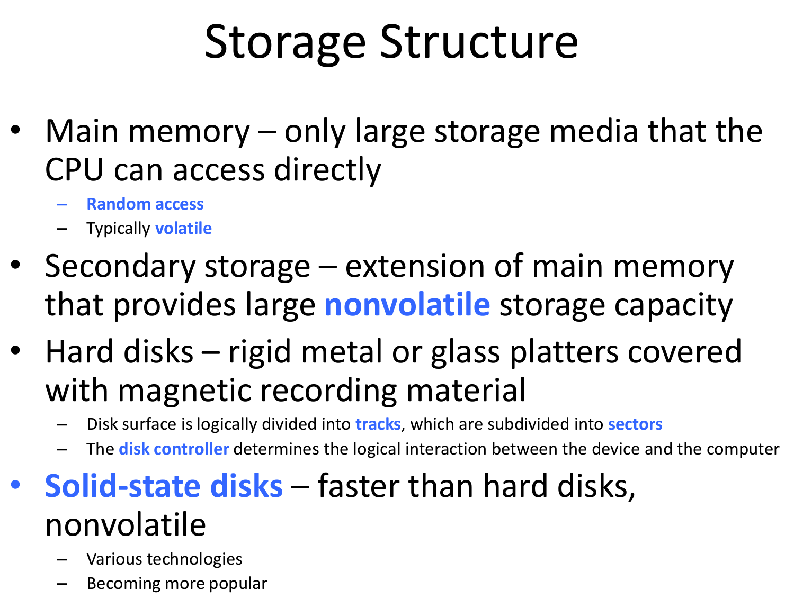

# CMSC412 Lecture 2  
> 8-31  

## Introduction  

*TODO*: Review 216 videos  

Prof has been teaching for 53 years and cannot get projector to work :))))  

What *is* a computer system?  

Lets focus for now on the CPU?  
* Perform instructions  

How does the CPU do this?  

  

1. Need to find out what the instruction is (opcode, operands, etc.)  

What is the most dominant thing of instructions?  
IOW, can we replace instructions with HW?  
* Yes

Looking at actual computer, what does it do?  
1. FETCH (Taking bits in memory and move to instruction register)
2. DECODE (Address, operand, data)
3. EXECUTE (Perform operation relating to opcode)  

All we are doing is moving bits!  

Moving bits depends on conditions (if-else,etc.)  

HW: Activation of circuits depends on the state of something  

Why save in reg. vs mem?  
* Reg. are quicker to access  

Where do results go?  
ALU must make signals as to where to go  

ALL WE ARE DOING IS MOVING BITS!!  

Illegal instruction
* Any instruction where the opcode does not exist in IS
* Arithmetical error (x/0)

What do?  

PC moves to next value after fetching  

When an error occurs in the middle of an instruction, what do?  
* There has to be a mechanism where error conditions are detected  
* Detection must be done in HW  
* HW must set flag  

Action
* Done in HW (Cannot do in SW since we are in the middle of the instruction)  
* The action done is changing the content of the PC  
* Therefore, next instruction is what was placed in by HW (hopefully the error handler unless we're FUBAR)  

How does HW know which value to switch to?  
* Location of error handler for the specific error encountered  
* Diff error = diff handlers  
* Pick up different address for handlers, which are stored in memory  

Based on the flag set, we must find the error address and place it in the PC  

This is called the **Interrupt handler**  

Once this is in place, we can suspend the exec of the current instruction and execute the handler  

*HW provisions*

HW interrupt routines do things that normal instructions cannot do. Therefore, must have privileged instructions

PI: Executed by specific routines

How does CPU know if instruction is privileged?  

Can this be done with opcode decoding?  
* ye lol  

How to tell CPU that we are in User (UP) mode or Kernel (P) mode  
* PS (Processor state) register tells CPU what mode and what instruction  

Permit the execution of PR instructions is the responsibility of PS  

So, how do we go from UP to PR?
* HW must do it  

When HW moves address to the PC, must do something with the PS that also changes mode
* ONLY when we are bringing th interrupt vector 

***FoUp: What is that something?***  

Polling method: Polling is the process in which the CPU constantly checks the status of a device to see if it needs the CPU's attention. It is considered as a hardware mechanism.

We have to be able to handle interrupt where sys. handling of errors is done in HW  

PS keeps track of current state of machine  

When we type char on keyboard, what do? 

*Recall*: keyboard has own CPU, takes info and sends it to CPU via wire  

How does CPU know you are typing a character?  
* Bus is used to see what characters are typed  

INterrupt handler goes through interrupt vector?  
* Reserve part of memory that has PS and PC values  

### Uses of kernel mode  

  

Certain functions are the management functions that we expect the OS to carry out (Kernel mode)  

What is protection?  
* Access mem. that is not part of your program. OS must recognize illegal access req. and take action  

  

Computer HW is completely hidden from user by way of the operating system  

### Computer system structure  

  

Hide all details of HW from user  

Convenient = extract meaning from bits  

Why do we need to use HW in efficient manner?  
* Different applications have different HW efficiency reqs.  

  

  

Tells processes how much mem. is available and distribute accordingly  
* Done via timers  

How does OS avoid errors?  

  

How does a computer start up?  

  

Nowadays stored in HW, (BIOS) program starts when electricity flows through it  

When BIOS comes in, recognizes there is more than one machine and asks which OS to use  

  

Is there a processor in the memory?  
* no tf  

Most of the above processes can work in parallel  

Is the memory shown above to be used by all of them?  
* Depends  

Main topic in this class will be how to handle concurrency  

  

One of the big diffs in archs is that most of the other devices are all under the command of the CPU, even if they are performing their own programs  

  

Suppose we want to prevent user programs from using IO, since IO is complicated. May be simpler for OS to handle it  

User can then request service from OS

If we define certain instructions that performs same process as interrupt, we have this exception  

Executing instruction: is it privileged?  

Wait for IO completion and then execute  

What happens at the end? There must be a provision where the computer picks up where it left off. Must save previous PC and PS. Must be done as a way of handling interrupts  

How many interrupts per second while laptop is idle?  
* Few thousand per second  

For this reason, interrupt handlers must be exceptionally fast  
* Must have very efficient code, and are therefore written by the manufacturers  

---
**Traps ~~aren't gay~~ vs. Interrupt**  
Traps: Exception in a user process. It's caused by division by zero or invalid memory access. It's also the usual way to invoke a kernel routine (a system call) because those run with a higher priority than user code. Handling is synchronous (so the user code is suspended and continues afterwards). In a sense they are "active" - most of the time, the code expects the trap to happen and relies on this fact.  

Interrupt: Generated by the hardware (devices like the hard disk, graphics card, I/O ports, etc). These are asynchronous (i.e. they don't happen at predictable places in the user code) or "passive" since the interrupt handler has to wait for them to happen eventually.  

TLDR: Traps come from you fucking up, Interrupts come from either Jensen or Lisa fucking up  

Vectored vs. polling interrupt  

  

  

  

Above shows two methods for IO structure  

  

  

  

  

  

There has to be a HW provision 

Every time we spend 100 ns fetch in memory we must keep track of what is taken  

Lots of management is required  

  

We have different controllers that act in the background that also want IO  

When they read from the disk, where should it end up so that its accessible?  
* Address space  

Every time the disk reads a byte or a word, use the common bus and let CPU know it needs more work  

What if we made the controller in the memory?  
* Much more powerful  

  

  

Multiprogramming batch computer would collect card decks and load them as a batch into a computer  

What is CRLF? (UNIX thing)  
* Carriage Return Line Feed  
* Left over from the UNIX days of type writers  

*See video from Panopto for OS sys. struct slide*  

   

  

  

WHen using VMs and we get an interrupt, who should handle it?  

  

User executable instruction that requests something from system  
* Slide demonstrates the ideo of switching between modes  

  

  

  

OS must make provisions to allow you access to memory  

  

  

  

*Must finish slides for next time*  

> Finished slides on the metro :sunglasses: