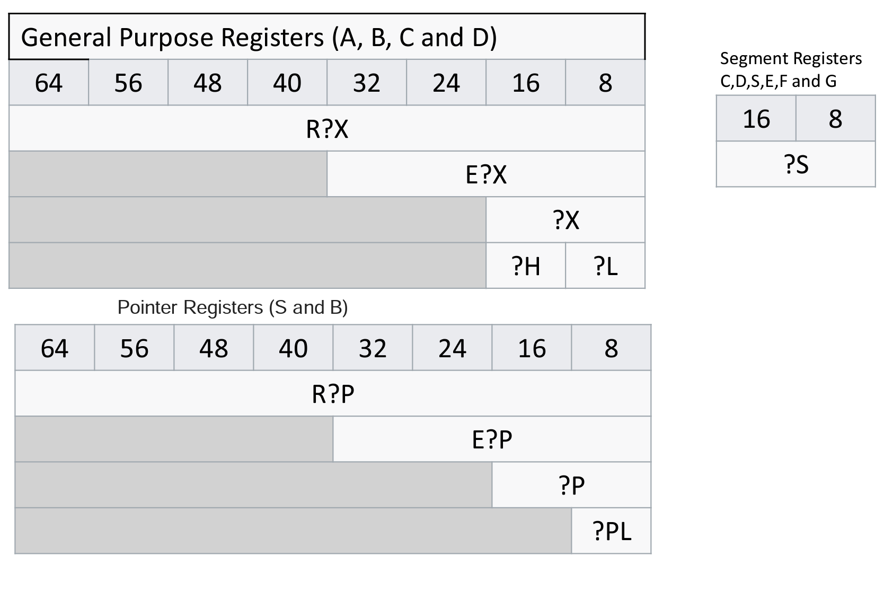

# CMSC412 Lecture 3  
> 9-5  

## X-86 Architecture  

*Last time*:  
Basic functions of the CPU  

*Today*:  
Take CPU details for the CPU we will use in this class (x86)  

ONe thing we did not talk about was the memory from last time  

  

The manufacturer decides the size of memory  

Each cell in the array has a specific address  

The integer becomes 

Access to a system memory is one at a time  

Who accesses the memory?
* Applications  

Memory controller to which an address is sent via a bus or comm. method  

How many bits req.? 
* All mem structs have integer power of 2 number of cells
* 2^n cells, # bits = n  

Access is made presenting n bits and RW flag  

Also need to specify what needs to be written in memory cell  

  

Can treat each cell as independent  

Take logical view: contiguous blocks of 2^k cells and name it a block  

Take address and split in 2: Block number and displacement within block  

Read address space in this way  

Block size != power of 2, divide by block size and look at quotient  

**Important ^^^**  

Mapping of address spaces  

  

Why? 
* Assign addresses for subroutines  

The essential req. for mapping is given address A in space A, must find a unique address in B   

Even cell sizes may be different with proper mapping  
* For now, 4-byte cell sizes  

4 GB mem, how many cells are there?  
How many bits of memory will I require?  
* 30 bit address  

Map every address to every unique address  

  

With this, can simply use lookup able  

Reducing size of this table, use blocks  

Use mapping of every block as a contiguous block  

This means the displacement does not change  

Address space is a virtual concept. Must be mapped to physical in order to be used  

**This is a general mapping concept!!**  

The better you know how the details work, the better programmer you will be  
> AA, 2023  

Most of the latest archs are backwards compatible  

  

  

CPU has to have many registers (GPR) 
* Registers instructions typically use  

There is a flag register, may keep something about the state, etc.  

Machine must have instruction counter  

E- prefix: 32 bits  
* If not, 16 bits  

Segment reg  

Any time something goes to memory, starts at the higher space and grows down   
* Our prerogative 
What you can do in HW is much faster than in SW  
* SW has instructions, thus slowing it down  

  

  

2 Levels of translation:  
* Segmentation and translation (paging)  

Anytime you write any program, Logical->physical space is done by hardware  

Doing the translation has a page table, converts to page table  

We are translating from virtual to linear , from linear to physical space  

The logical space has segments and offset  

The two sides don't have to be same size when doing mapping  

Take logical address and convert to linear address as a 32b unsigned int  

Then we get physical address  

  

  

Lower the number, higher the privilege  

  

Here ^, we see the structure of various registers  

  

  

GDTR, LDTR point to start of each table  

  

  

Each executing can have up to 6 registers  *???*  

We take these addresses and mapping them  

  

GDT, LDT- Global and Local Descriptor Table  

INdex into table pointed by GDTR and LDTR  

  

  

The interrupt enable flag can be set to 0 or 1 to enable/disable interrupts  
* Many of these bits are set by the hardware  

  

  

Going back, 3 tables highlighted. These are the registers that control these  

  

Page directory: Directory that translated pages to page block *???*  

Page number to page frame
  

  

  

Paging: Linear -> Physical  

  

Remember: logical address has segment and offset  

Lin. addr is 32 bits, divided in 3. (Dir, table, off)  

Bits in offset depends on size of page (4k, 4Meg)  

Going to 22 bit size, table is ignored. 4k = 12 bits for offset, table becomes 10 bits  

All of this happens in HW for every access in memory  
* This is why we use bit arithmetic instead of traditional (Schoolbook) arithmetic  

Anything coming from the registers must be very fast  

Linear address is 32 bits  

  

Segment has certain amount of bits  

  

GDT is common among all. Local is not. Local must change with each new segment  

  

Segment limit is arbitrary  

P bit- Segment is absent?? 
* No, means its not in the memory, it is not initialized  
* OS has to come in and adjust as needed  

  

  

HW does addressing differently based on size  

Most of these ^ are set by hardware  

  

  

  

System call: activates again. Call to a call gate can call a procedure  
* In doing this, privileges are checked  

  

  

  

  

  

Non-maskable: Cannot disable them (embedded opcode, exceptions, etc.)  

  

  

Amount of time between interrupts: 1/2 ms  

  

  

  

Current state of any task is captured here in the Task State Segment (Slide 52)  

  

  

  

Task == Process  

  

  

  

  

  

  

  

I hecking LOVE when professors fly through slides and read off the slides verbatim for half the class!!!!!