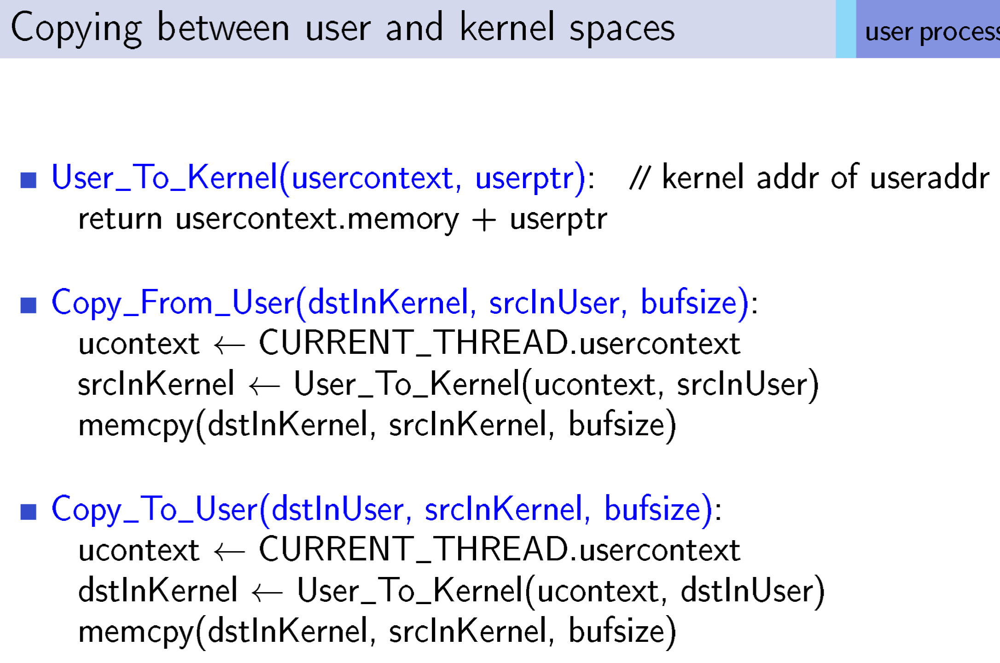
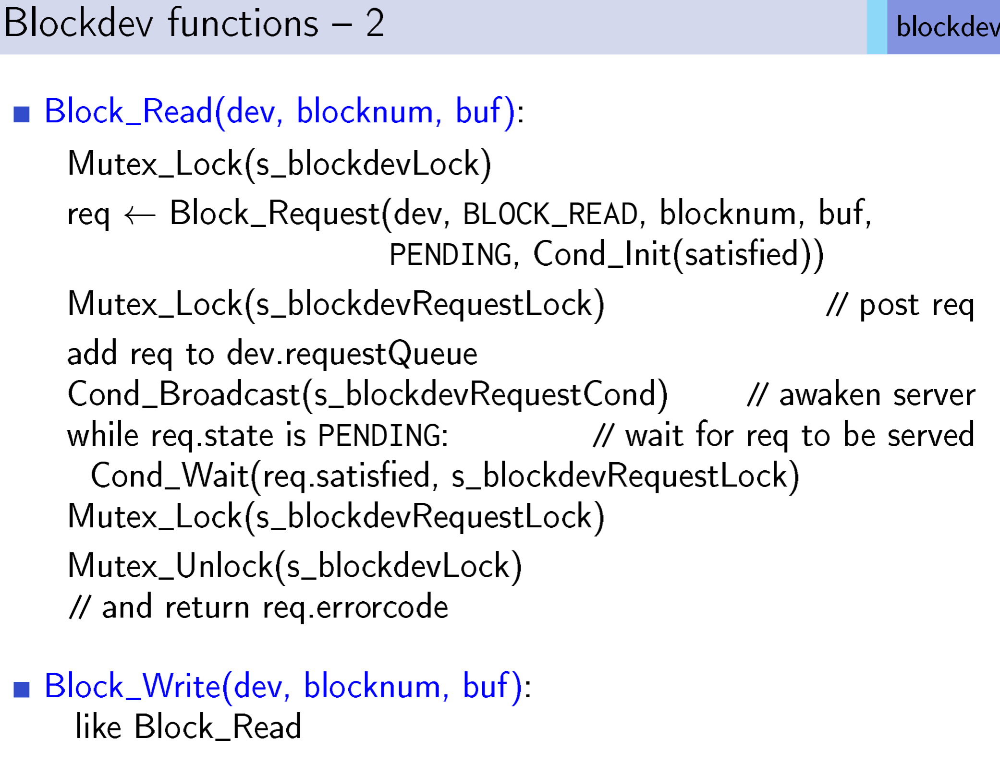

# CMSC412 Lecture 4  
> 9-7  

## Geek OS  

*Today*: Compact overview of GeekOS  

  

  

APIC: ... Interrupt controller  

4 CPUs that have a shared bus. Bus moves the bits around. If an interrupt needs to be moved from one CPU to the other, use the bus  

*Remember*: INterrupt == HW  

How does a CPU know an interrupt on the bus is its own?  
* Bus has to have address lines. That way, if interrupt is in CPU0's address, CPU0 knows it has an interrupt   

diskc: kernel image, functioning in virtual environment  

  

Protected mode can only be reached *from* user mode  
* Has 4 privilege levels  

  

What do segment descriptor tables contain? 
* Global and local descriptor tables  
* Interrupt descriptor table  

Segment descriptor points to a segment with starting point and  

  

IDT: Int. desc. table  
* Has 256 entries, one for each interrupt  

INterrupt gate points to int. handler  

  

All general purpose registers are 32 bits in GeekOS  

eflag contains current state of execution  

  

Disable/restore interrupts 
* There are certain functions that we carry out that we don't want to stop in the middle of process  

  

Calibration: Ensure all have the same value  

Allocating CPU to process, allocate for fixed amount of time. Based on number of CPU ticks  

  

  

Supports are specified, and are accessed by IO instr  

  

Keyboard data is used as input  

No output to the keyboard, therefore no output register  

  

Keyboard must just send characters at any key pressed  

  

IDE is essentially a bus. Used to transfer data  

Whatever we transfer is 16b  

PIO: Programmed Input Output  

DMA: Direct Memory Access  

Cylinder? Head? ~~So no head?~~  
* Will discuss later in semester  

  

Device driver does the conversion  

  

Will not be using DMA too much  

  

During setup, interrupts are handled by the BIOS  

Change to OS of CPU

  

  

GPF: General Protection Fault  

  

  

mutex: Mutual Exclusion  

  

  

  

  

  

UC: User context  

We are trying to create an image that, when called with run, will execute  

User SS: Stack Segment  

  

User process does not have access to the kernel space. Therefore, must have process that can call something in the kernel *???* (Slide 31)  

  

We want program to run in a deterministic manner  

Many mechanisms for this require OS support  

Atomic action *???*  

If, due to Atomic action, there are instructions we cannot execute. We need to wait. How?  
* Spinlock  

  

We are waiting for the eax (GPR) to become 0. Once it is, we turn it to 1  

  

  

  

Mutual exclusion *???*  

  

  

WDYM by switch?  
* Switch of a task  

Kernel task, user task, wtc. 

What happens at scheduling? 

Why would an incomplete thread give up the CPU?  
* May be waiting on something  

Low-lvl interrupt handling  

  

  

How long will this ^ take?  
* Ans: very Fast (TM)  

  

VFS: Virtual File System  

  

How often do we use direct access?  

Sequential is the most common way of reading files  

  

  

Specify the path and the mode we will be accessing the file  

FIle systems are collections of directories  

  

  

  

  

FAT: File Allocation Table  

  

  

  

  

  

  

  

  

  

Where does this notify exec operate?  
* Whoever made the request, i.e the user
* However, it does not go to the user, instead to the OS  

  

Cache: Memory that can store data that can be trickled down to slower devices  

  

  