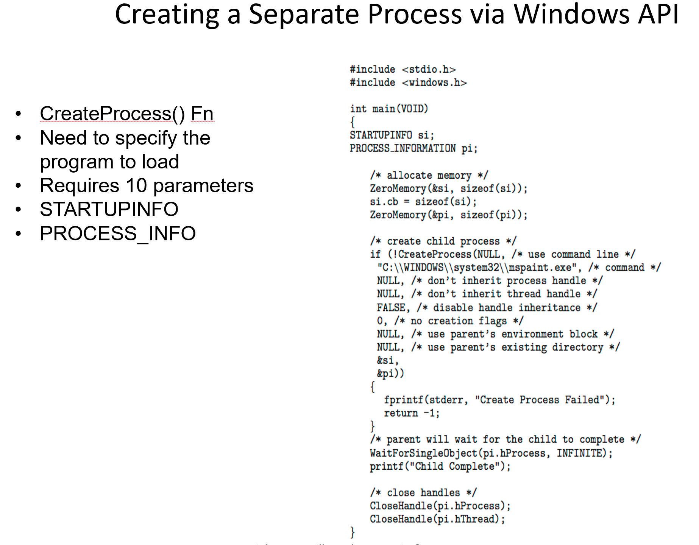
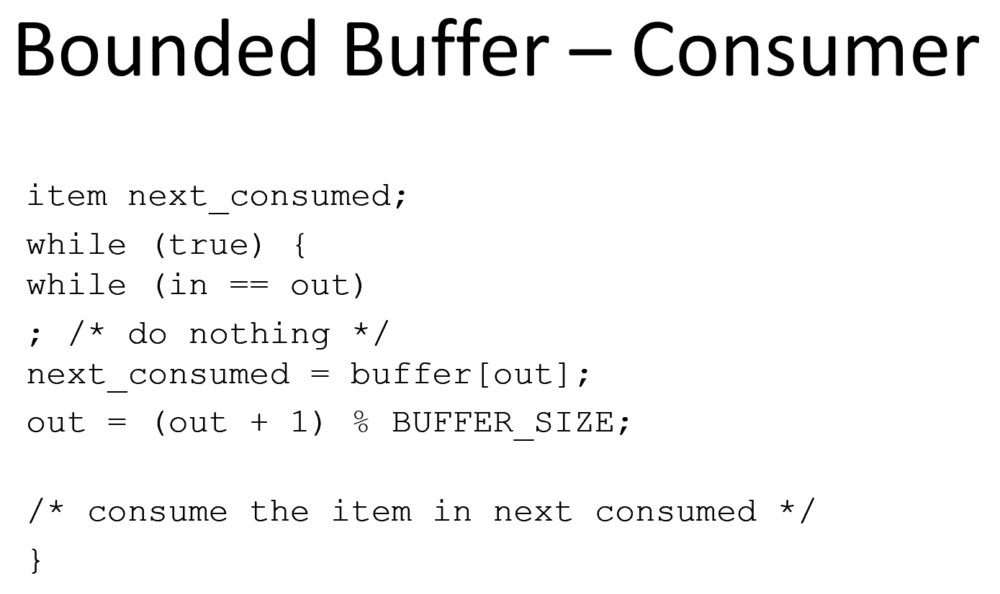

# CMSC412 Lecture 6  
> 9-14  

## Processes  

  

Process v. program  

*Process*: Program in execution
*Program*: A passive file, a collection of code
* Can be in different forms (object, source, etc.)  

Resources to run: 
* CPU  
* Memory

When a program is executing, we call it a *process*  

Who manages exec?
* The OS  

  

  
*This isn't the only way to do things*

OS is the one that enables a program to become a process  

How is this done?
* We start the exec of program via user input (CLI, Desktop, etc.)  

  

When a program is in exes, how does the OS keep track of it?
* Mostly done via tables  

WHen process is doing IO, has to wait. Thus, may or may not be using the CPU
* This is called waiting  

In the OS, there may be multiple tables corresponding to multiple states  

When ready, we have all resources *except* CPU  

  

With a single CPU, how many processes can be in each state?  
* However many as are available can be in any state EXCEPT running
  * Running can only have one in this context  

  

This is where, if we are going to be taking control away from process, we need to store it to resume the process  

We are storing a variety of useful info about the process  

  

All the values of PCB need to be handled  

PCB has registers and stuff
* Can they be reloaded in any order when resuming?  
  * IOW, what is the last thing I load?

Ans: Program counter and program state register  *???*  

Our processor executes n instructions in a nanosecond, and we give it i microsecond?
* 1000  

When we start exec., how many memory locations will we able to access?
* Program req. 16 GB  

Suppose we have 2 CPUs. There is one address space. On 2 CPUs, we have 2 PCs pointing at different places
* Is there problem? :tf:  

Not really, depends on number of CPUs *???*  

Now, we have 2 execution points  
* For each exec. point, we need to keep independently ??? (Called threads)  

A process can consist of multiple threads  
* Need to keep this in mind when programming

  

  

  

OS needs to schedule the processes  

Many queues
* Ready, devices, etc.  

Processes go from q to q  

Scheduler looks at queues and chooses which goes next  

  

  

When a process is born, starts at new, then goes to ready  

Depends on environment how many queues there can be  

OS maintains multiple schedulers  

  

Time for scheduler == very smol  

When a process is born, not put into ready immediately  
* Has to do with controlling the degree of multiprogramming  

Degree of Multiprogramming:
* How many processes are in this context?  

What type of programs have we written up to this point?
* Nearly a are IO bound
  * Compiling == reading files

CPU bound jobs are in high-performance computing (modelling, simulations, etc)  

How does the scheduler schedule itself?  
* Invocation of scheduler is part of OS handler of interrupts  

  

Different OS have different names for these schedulers  

  

Background processes do not interact with the user interface  

  

  

  

If a process creates a process, should the parent provide the resources?  
* Depends on structure  

  

  

New process must have program, user space, and memory  

`fork` creates an exact replica of process  

When duplicating exact process space, will execute exact code UNLESS provision is given to have child do other code (`exec`)  

  

When a fork command is executed, everything is duplicated, even prog counter  

  

  
Must every process have a parent?  

* Yes, except for init  

  

There can be a cascading termination wherein all processes from parent are aborted when parent itself is aborted  

  

ho to get list of processes in windows?
* Task manager  

  

How to they share data?  

  

  

  

Anytime we try to connect 2 processes where one is sending info to the other, there are structure concerns  

Must we have a buffer?  
* Each block is passed on using prod-cons relationship  

How many buffers should we have?  

  

  

  

  

Can a reciever reader read the buffer without the producer having placed anything in it?  

* N OMEGALUL  

And vice versa  

  

  

  

  

Receiver has to be attentive, thus it is an active process  

  

  

Who established the mailboxes?  
* OS  

Mailbox can be linked to multiple processes  

  

  

Very context-dependent  

  

  

For now, assume all buffering to be FIFO  

**Double buffering: Look up**  

  

  

  

  

  

  

  

  

  

  

