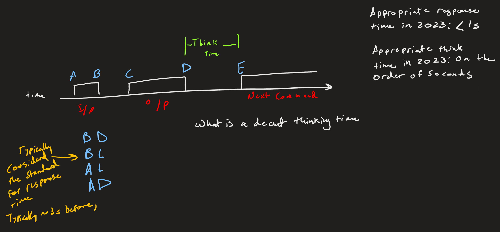
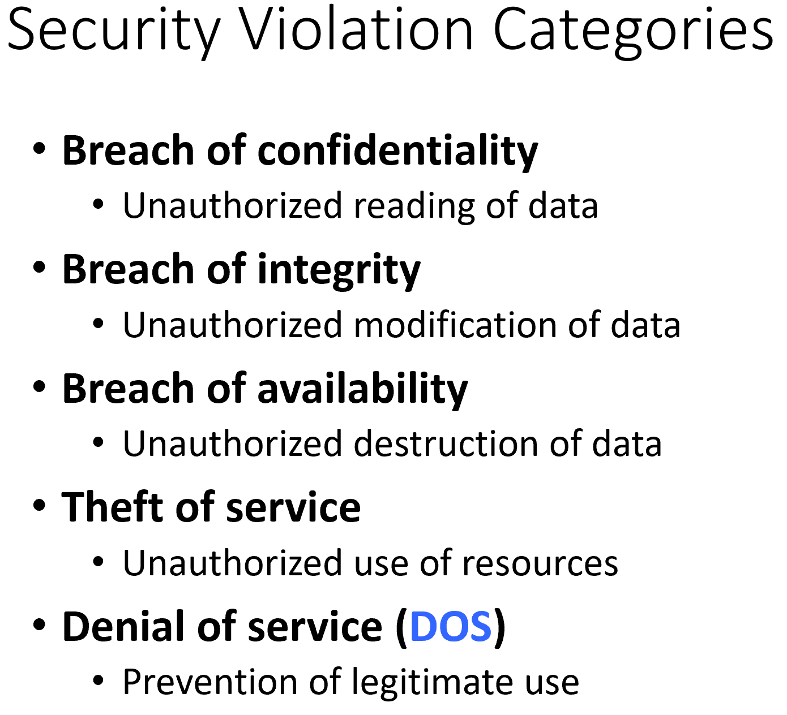
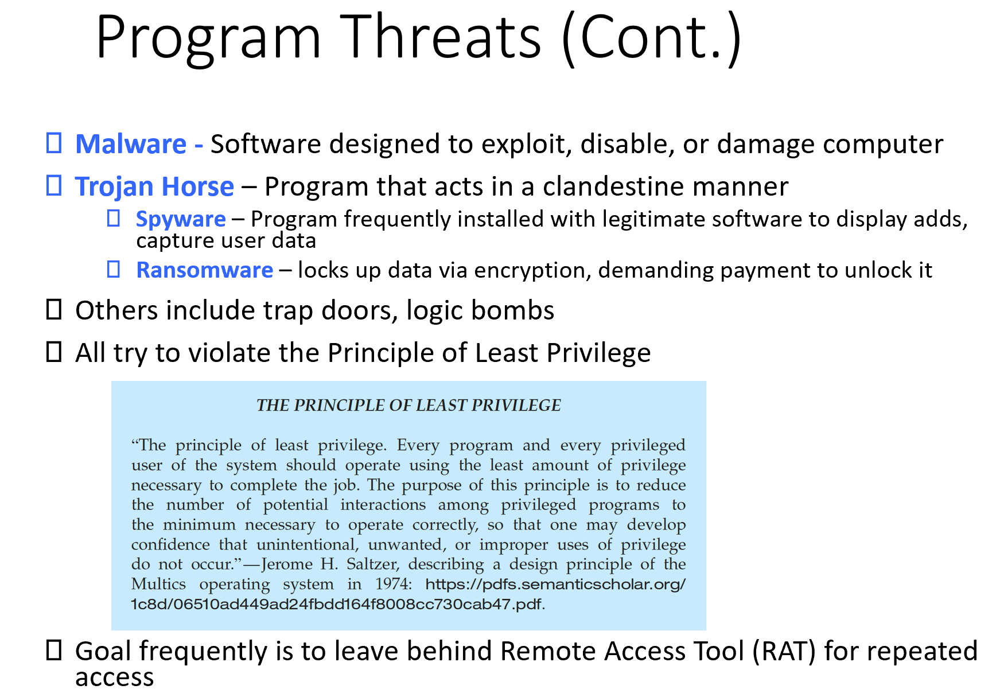
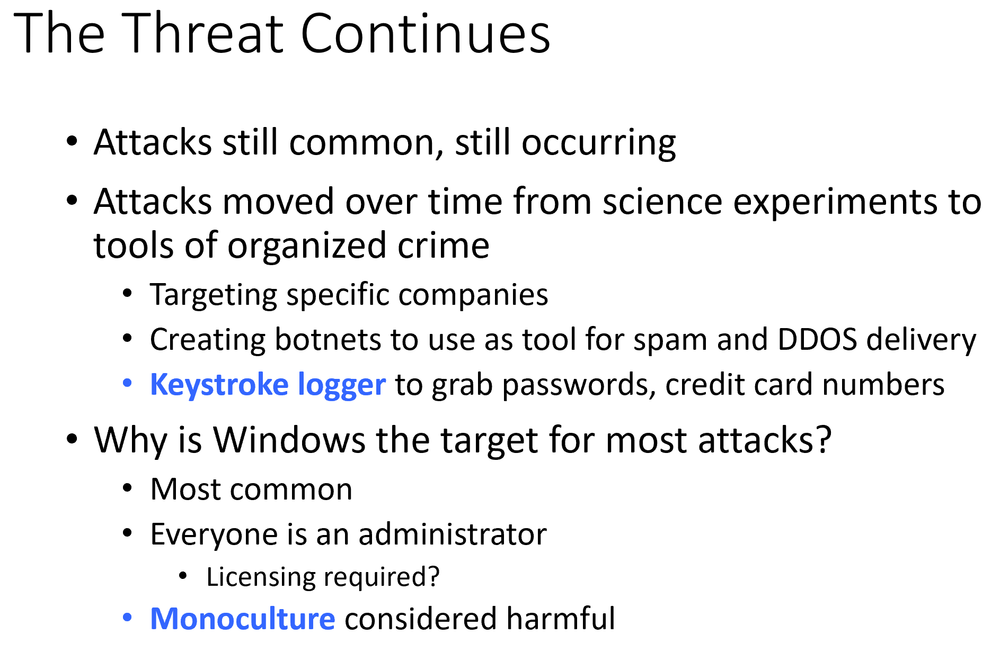
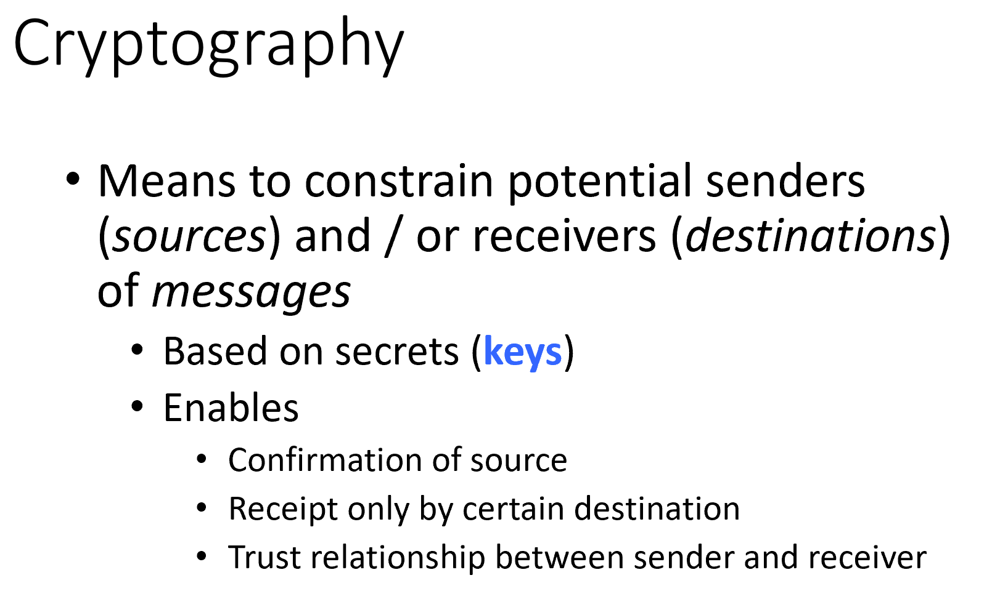
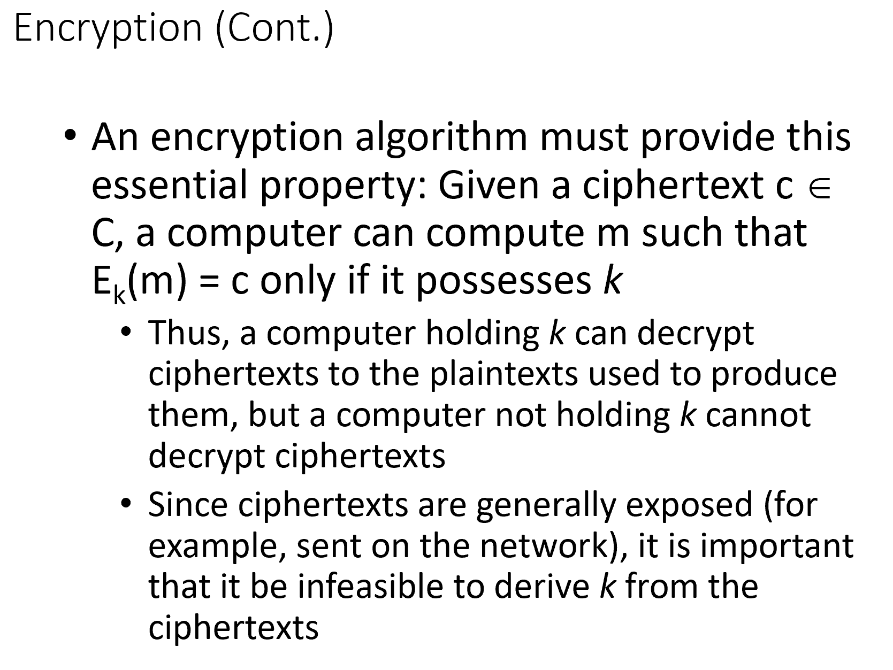
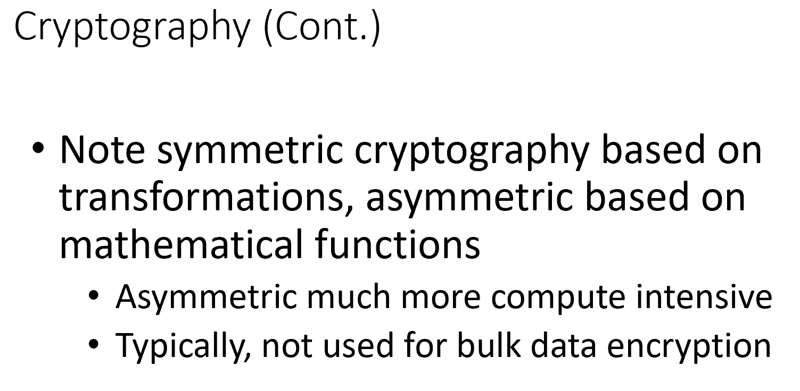
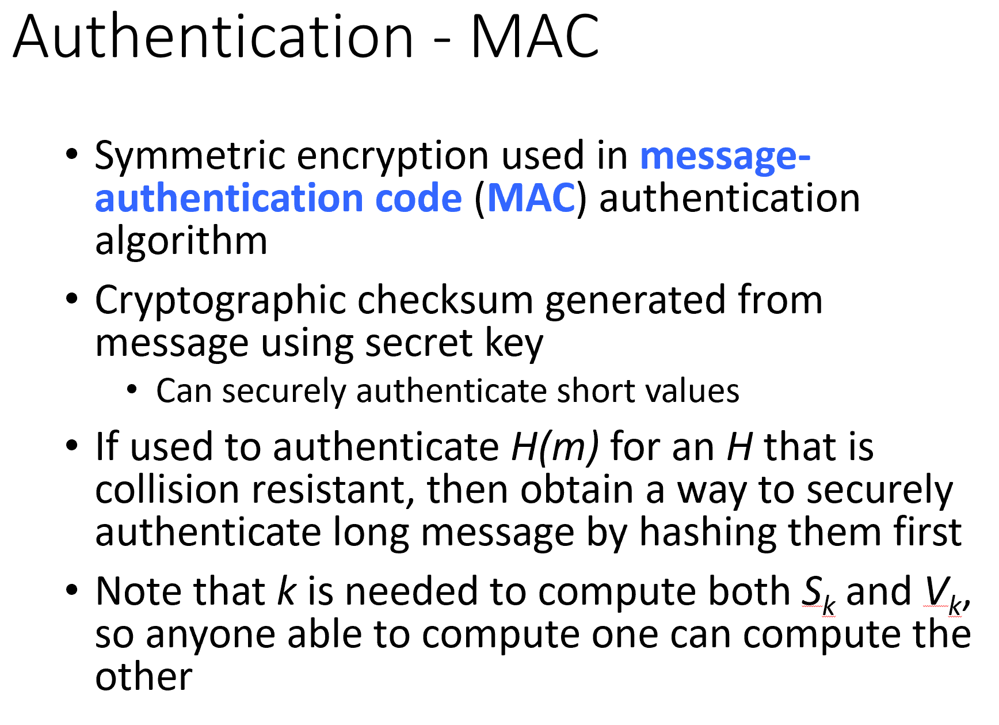
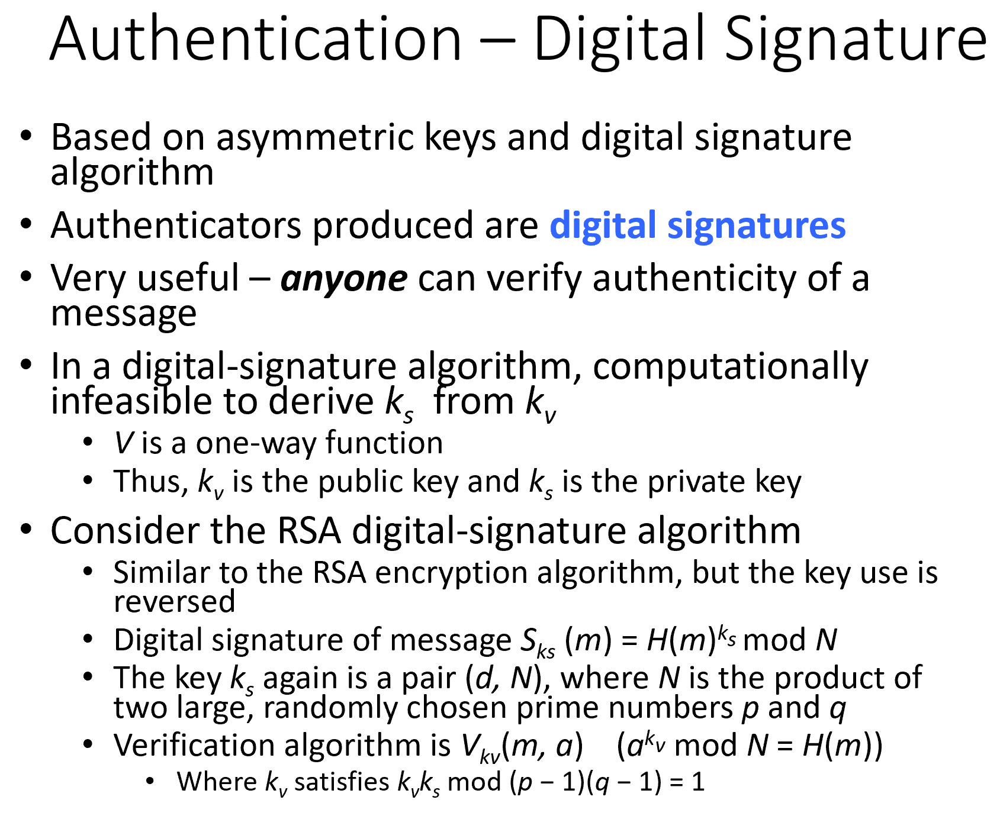

# CMSC412 Lecture 5  
> 9-19  

## Threads  

This is the entitiy that processes control. Managed by the OS by the processes  

Each process has its address space, stacks, heaps, etc.  

How does OS managed it? Through Process Control Block (PCB)  
* Must keep track of the management of the process  

  

Even with one CPU, we can give control to different processes for emmensly small periods of time  
* This is due to multiprocessing 

Not matter how fast a processor is, in a finite amount of time, only a finite amount of instructions can be done  

Amount of memory that exists can be very small  

Suppose we had second CPU. Can it also execute instructions in the same address space?  
* Yes, but needs its own PC  

Is there a logcial inconsistency on this?  
* No  

Suppose we have one process, with multiple CPUs
* Causes clobbering  

There *are* dangers, just not logical ones  

  

What is cache doinng/do?
* COpy of address space  

  

  

  

Threads are part of A process  

Address space belongs to process, NOT thread  

they work collaboratively so nothing is clobbered  

Threads run within the application  

What must we do to create a thread? 
* Specify PC 

  

  

  

Distinction between *Paralelism* and *concurrency*  

Para: do two tings at the same time
conc: Do multiple things one at a time switching rapidly

  

We can take any process, stop it for an arbitrary length of time with no impact on fucitnosality  
* If we have a process T1, we may share to T2 or T3
* Synchronization reqs. come into play

Anytime you use computers to interact with IRL, timing becoems an impartant factor  

  

How many PCs can we have? assign different PCs to different threads  

To run any thread, we need at least one CPU  

  

Hardware supported threads may have different registers  

How much can we speedup?  

  

There is a serial portion and a parallel portion  

  

One processor can have 8 threads
* this is HW supported  

Unit of CPU management is becoming a thread  

User threads
* Application to the kernel looks like a signal process  

How would an application manage threads at an application level?  
* THis application only runs when the OS gives control to the particular process  
  * Now, it acts as multiple  

We are saying, for any application, the user has to handle it ??? (Slide 18) 
Controlling threads at user level, there is a module that handles this  
User knows better how to use the threads for the application  

Kernel threads
* Visible to kernel

User "
* Not visible to OS
* App specific  

  

  

  

Mapping responsibility falls on either one (depends)  

  

  

  

When writing programs, we use the API to the thread lib. that at runtime can carryout the mapping  

  

POSIX is a specification of how the API should work, NOT the actual moving parts themselves  

  

  

Pthreads may be a kernel thread,  or not. Depends on how it is called  

  

  

  

  

  

Language processors are providing support to split stuff up into multiple threads  
* What must compiler know about program in order to do that
  * Are there sections of the program that can be run independently

  

Most OS control degree of multiprogramming  
* Number of threads is bound by thread pool  

  

  

  

  

  

  

  

  

  

  

  

  

  

These will be stored where we keep track of the tasks, TSS

  

  

All these are handles by the operating system  

  

