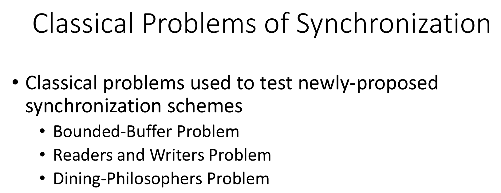
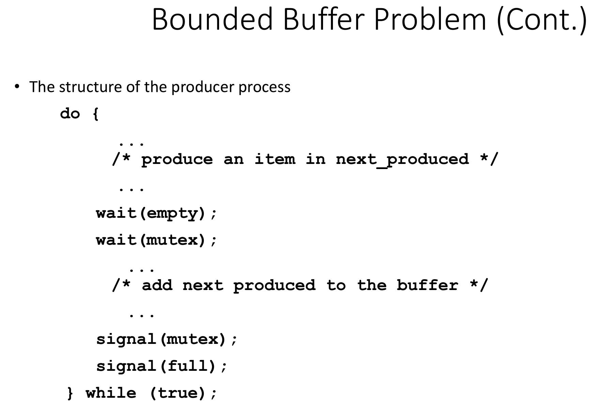
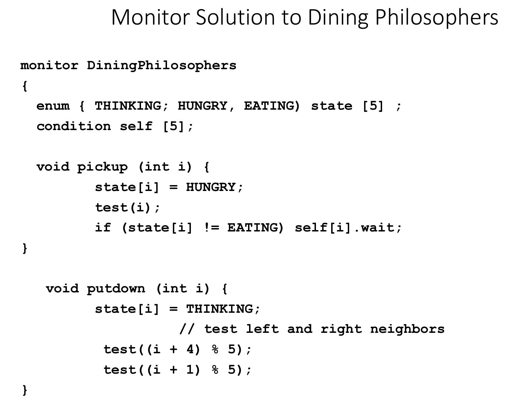

# CMSC412 Lecture 10  
> 9-28  

## Synchronization examples  

   

So far: Various kinds of synch problems and issues
* Many mechanisms to fix them  

Common denominator: atomic action  

All these actions are based on hardware atomic action  
* Either it is done or not at all  

We build on top of that the mechanisms we use at the higher level for ease-of-use  

There are some problems that are standard  

  

In each of these, there are certain assumptions we make

  

Assume: No buffer may be accesses by reader/writer at the same time  

What properties must the solution hold?  
* Both prod and cons are independent  
* Finite N buffers  
* Buffer can be completely empty or full  
* Can we let prod make more in buffer if its full?
  * no
  * Prod must wait until buff is empty b4 making more
* Same thing with cons  

We may be asked to use certain tools on exams (semaphores, mutex, monitors, etc.)  

Can we just use a counting semaphore?  

Binary semas most commonly used in critical section (CS)  
* Protecting a certain section in code  

When we modify CS, no one else can  

  

  

  

We are talking about mutex to protect CS  

ANy writers access must be a critical section  

How many readers are accepted, etc.  

  

  

Who has priority here?  
* Readers? 

When we are taking a look at synch problems, it depends on how we identify the params  

Once we define reader, any N of readers exist. Same goes for writers  

You have ti think about how you put solutions in

  

  

We consider the chopsticks as resources. If all philosophers get one chopstick, we will remain in deadlock  

  

Structure of phil:
* Picks up chopstick i and chopstick (i+1) % 5  
  * May lead to deadlock since each may pick their left/rightmost one at the same time, leading to deadlock  

What do?  

  

Monitor solution: See Neso Academy video  

Since we only have one process in the monitor at a time, all actions that happen in the monitor are atomic by virtue of being in the monitor  

Depending on the process of the routine it is executing, if that routine has some wait on conditions, it is put in wait queue. No value associated with wait and signal. Not the case here. 

We define states for each phil:
* Thinking, Hungry, and Eating  

`pickup`
* Change state to hungry
* test(i)
  * If state[i] is *not* eating, we wait

`putdown`
* Change state to thinking
* test L and R neighbors

`test` is an internal function for the monitor  

No matter what the condition is (unless I am stuck in `test`), I will come out of these routines OR be put in a wait queue
 

  

Called by i  

If the state of L neighbor != eating AND state of me == hungry AND state of R neighbor != eating, change MY state to eating  

Then signal  

Monitors only allow one process at a time. Therefore, by virtue of being in a monitor, any action done in a monitor is atomic!  

  

  

  

  

If your fundamentals are clear, any OS or machine variables will be obvious  

  

Spinlocks will spin in place and use CPU cycles as it waits  

  

Third bullet important!!  

  

  

  

When you do r/w to mem., you could bring it in, update, and put it back  

  

  

Next topic PagMan  

## Deadlocks  

  

  

  

The system consists of n number of resource. Each in turn has many different instances of resources. 

  

We do mutex on 1st in DW1, then mutex on 2nd on DW2, thus leading to deadlock, since each function is waiting for the other to release the mutex  

  

Livelock: Another form of liveness failure. Both live/deadlock prevent two or more threads from proceeding, but the threads are unable to proceed for different reasons. Whereas deadlock occurs when every thread in a set is blocked waiting for an event that can be caused only by another thread in the set, livelock occurs when a thread continuously attempts an action that fails.  

In this example, if both these functions are on respective threads andd happen at the same time, T1 will lock M1 and T2 will lock M2. Then, both will try to lock the others' lock. But, since they have each locked their own, `trylock` fails, and they go to else, releasing the lock they locked. Then they try again and fall in the same trap!  

  

> This looks like an exam problem...  

  

  

  

  

There is no way all the resource reqs. can be met  

  

  

  

  

