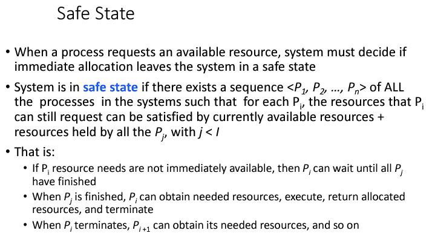
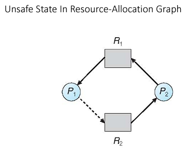

# CMSC412 Lecture 11  
> 10-3  

*Watching 2019 Panopto lecture*  

## Deadlocks  

*We already covered some of the first portion in the previous lecture, but I'm gonna start from the beginning anyways because FYATHYRIO*  

  

Deadlocks occur when there are a collection of processes that cannot make progress  

  

  

The model we work with ^  

We ask for resource, and wait for OS to give us resource  
* While we wait for that resource, we are in a queue  
* Each recourse type has certain amount of instances  

By definition, no one process will hold onto a resource forever  

In practice, this may happen though  

  

From here, we can see that the first mutex locks its mutex, and the other does the same for the second one. Then, each tries to get the others' lock. However, since they have each gotten the one that the other is trying to get, they get blocked waiting for the other to release their respective locks  

  

This one is called a "livelock" since the program does something constantly forever instead of waiting whilst being locked. Let's look at thread 1, where it locks `lock1`. Then, it tries to lock `lock2`. However, ~~bitch-ass~~ thread 2 already locked it, so the check that thread 1 does fails, and it goes to the else statement where it releases its first lock from the beginning. Since we are in a `while` loop, however, now ~~dumbass smooth brain~~ thread 1 tries it again , where it obviously fails again and again. The reason this is a livelock and NOT a deadlock is because the thread is actually doing something, its just not making any progress .  

  

ALL of these must be held in order for deadlock to occur. If even one of these is not true, deadlock cannot occur

  

  

Individual instances of the resources are represented as mini squares in the bigger resource square  

When there is an edge from Process->Resource, that is a Request  

When there is an edge from Resource->Process, that is a Grant/Hold  

  

R2 holds 2 instances of itself. R4 holds 4 of itself. P1,2 are both holding both of the instances of R2. P1 requests R1 while R1 itself is granting P2, which in turn is requesting R3, which in turn is granting P3 *whew*.  

oh and also R4 is all alone veri sed  

Note that, since there is no cycle in this graph, we can confidently say there is no deadlock possible. However, the inverse is NOT true.  
* If there is a cycle, there MAY or MAY NOT be a deadlock possible  

  

Here, we see that P1 is waiting for R1, which is granting P2, which is waiting for R3, which is granting P3, which is waiting for R2, which is busy granting P1,2. Since both P1 and P2 are waiting for their respective resources, they are stuck, and we have deadlock.  

and R4 is still all alone veri supa mega sed  

  

Here, we have another cycle. However, as aforementioned, this does not guarantee a deadlock. As we can see, P2 has all it needs and releases R1, which in turn grants P1, freeing up an instance in R2, which in turn allows R2 to grant P3's request, and P4 is completed and everyone is veri happi except for R4 and R3 who were killed offscreen apparently  

  

These explain how to find deadlocks in cyclic graphs

  

4 methods:  
1. Prevention
2. Avoidance
3. Allow & Recover
4. Ignore  

  

  

Making each of the reqs. for deadlock false: 
* Mutual exclusion:
  * Make the resources sharable
  * Not possible in some cases (printer)
* Hold & Wait:
  * Try to do no hold & wait
  * Try to give process all the resources it needs at once before it executes
* No Preemption:
  * Make preemption to be true
  * Done using time time quantum method
  * Time Quantum Method: Allocate time to each process. When time is over, resources must be released  
* Circular wait:
  * Number all resources and request resources in ascending / descending order

E.g: 
1. CPU
2. Printer
3. Scanner

   * Therefore, process can request resources in increasing order. If any process tries to request a #1 resource after requesting and being granted a #4 resource, it is ~~told to fuck off~~ not given the resource  

  

Here ^ is an example of what I said. In case you can't read my god-awful no-improvement-since-2nd-grade handwriting:  

> Here, P1 has requested and was granted R1 which is numbered 1. It now requests R2, which is allowed since R2 is numbered 3, and the requests are done in ascending order. P2 has requested and was granted R2 w/#3. However, when it requests R1, it cannot do so since the request is in descending order  

  

We don't guarantee prevention, we merely avoid it  

  

Essentially, what order can processes be done/ granted resources s/t everyone is completed AND there is no deadlock?
* This is what we need to answer to find the *safe state*  

  

  

Deadlock is only a subset of unsafe states. There could possibly be no deadlock yet we are in an unsafe state  

  

ONLY in the case of single instance resources does a cycle indicate a deadlock  

  

  

  

  

So, cycle != Guaranteed deadlock. HOWEVER, it is still possible for a deadlock to happen, and even more pertinent to this context, a cycle in the graph would mean that we are in an unsafe state. Therefore, we want to avoid cycles at all costs  

  

I already did the walkthrough, and I p much understand what to do on pen and paper, so I don't really need to go through these :sunglasses:

  

  

  

  

  

  

**Im pretty sure there is a typo here, P2 and P0 need to be switched around since we go back and check in on P0 after we finish with P4. Though it may be an arbitrary order, idk**

  

  

Avoidance: Make sure that a process is allocated resources only if doing so will not cause us to go to unsafe state  

  

This is NOT the same as a resource-allocation graph  

  

This ^ shows us that we have a deadlock, since we have a cycle: 

P1->P2->P3->P4->P1  

Note: This is only for single instance of resource

  

We need to do a slightly different version of the bankers algo.  

The main difference between Bankers and Detection is that in Banker's, we know beforehand the maximum resources that each process needs in order to function correctly. Based on the max and how many resources are available, we determine if we can complete the ith process. If not, we continue until enough resources are available to complete it. The detection algorithm works off of requests. IOW, we already have resources allocated (just like in Banker's), however we are asking for additional resources with no regard as to whether it is the max amount of resources that the particular process needs.  

  

  

  

  

  

  

  