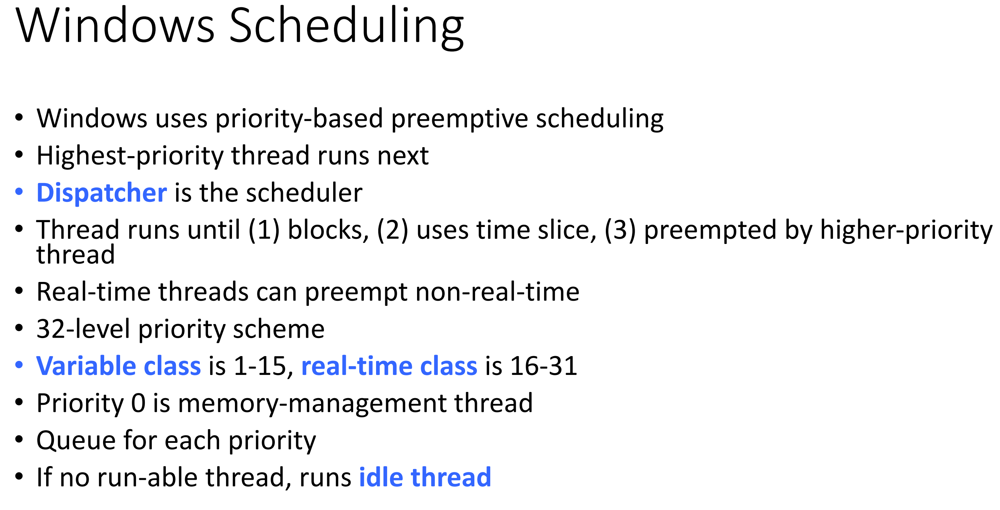

# CMSC412 Lecture 12  
> 10-10  

*Watching March 12, 2019 Panopto lecture*  

## CPU Scheduling  

  

Recall the difference between Policy and Mechanism  

What does it mean to schedule?  
* We have processes in the ready queue, waiting for CPU
* Deciding which processes we take from ready to CPU

Managing states and budgeting processes  

Before: Threads. Now, we assume that we are managing processes  

Any process in ifs lifetime goes through certain states  
* Ready
  * A Process has recieved all recsources except for CPU 
  * In ready queue   
* Running 
  * In the running queue
  * No process in running state ever?
    * Yes, interrupt, deciding which process to give control
    * Apart from that, there is only one process per CPU
    * Kernel is not considered a process, and does not need to be scheduled
  * What can happen?
    * Complete process and go to terminated
    * Interrupt comes in and cpntrol is taken away
      * From here, go to ready state until control is given back OR, if IO needed, go to waiting ASOASF
* Terminated
  * Restore state of process

Scheduling means 
* Selecting a procss in a ready queue
  * This is a policy question
  * Do many tjhings (May be done atomically)
* Decide on a time quantum (if applicable)
* Restore the ame state of the process
  * When in reayd, this states remains in GPR (General purpose registers)  
* Change IC 

Typically, a process is gonig trhough this V loop  

  

What do we try to achieve with our scheduling policy?  
* Busyness!  

Spinning lock is a way to wait. Can we do that here?  
* N OMEGLUL
* Scheduler is not a process
* If we put cheduler in the queue, what will CPU do??  

5 processes waiting, and we keep our CPU fully busy with all of them. 
* ONly time we are wasting is when we do not have anything in the ready queue  
* Scheduler can noly allocate from ready queue
* Must optimize time (User side)
  * Depends on how quickly we can get the CPU
  * We want to be responsive to all processes that are active in the computer at one time  

Selecting from the processes in the ready queue
* When scheduler gives process to CPU, how long will it take to relinquish control?  
* Determined by CPU bursts  

We throuhg this ^ loop of bursts, running and waiting constantly  

Everytime we come into ready state, then to running, how long can we run until we need to wait to IO?
* Assume no interrupts

Typically, can talk of CPU burst as time a process can use the CPU  
IO burst is the IO request we make  

During IO, we go to the outside devices which are much slower than the CPU  

We get into waiting state and wait for longer times than CPU cycles  
* Inherently IO will take longer  

Depending on application one burst will dominate the other  
* ^ Computations, ^ CPU bursts
* ^ Device handling, ^ IO bursts  

Word processing
* IO bound  
  * While doing this, backgorund processes are displaying characters, GUI, etc.

Weather app
* CPU bound
* Many sensors, a lot of data that needs to be processes  

Buisness app
* IO bound
  * Ledgers, book keeping  

IRL, most processes are IO bound  

  

Burst in miliseconds is very small. Most burst lie less than 8 miliseconds  

Some bursts may take a long time  

Knowing this, we can take it into account when designing  

  

Which one is selected depends on algo, queue order, etc.  

When would the scheduler come into effect?  
* When a process is running and goes into waiting state  

Nonpremptive
* Once you give control to process it holds it until it voluntarily gives it up  
  * May be done by going top wating or by termination 

Scheduler needs to come in when the process relinquishes control  

1 and 4 are the voluntary actions  

Preemptive  
* WHenever, whatever you are doing, you are forced to stop  

  

Dispatcher comes in to perform these ^ operations  

There is no saved PC value! What do?  
* Start with PC value that th entry point was when we started the scheduler  

If, in between, there is an interrupt, it is not a part of the dispatch latency  

WHat should a policy try to achieve?  
* WHen we are selecting a process to exec next, we should try to keep the smallest time  
* We want to keep our devices as busy as possible

Keep in mind the kind of env. where this technology was made
* Shared kernel with one mainframe  
* Based on CPU usage, people were charged
* Turnaround time  

All these things influence how we implement things / how things are done today  

  

*He starts to draw on a board that I can't see in the video :(*  

*But he does it in person!!!*  

  

Observation: Every one of these has to do with TIME  

  

Naive approach: First come first serve  

Here, we are concerned with how long each process spends in the waiting queue  

  

Now, if we order it from shortest to longest task, average waiting times decrease dramatically  

Arrival as well as policy can impact the response times you can get  

  

Asking the user does not work, since user either does not know length or lies to gain priority  

  

How do we prove this is the smallest average wait time?  

Can we change the order s/t the wait time becomes smaller?  

*Check ~35 min*  

  

SJF is a nonpreemptive process  
* Assume that, once we are given CPU, we involuntarily relinquish it ???

We can monitor how long the previous bursts were and predict the next one from this  

Predict next CPU burst on previous and an exponential averaging  

if alpha is 0, tn does not make a difference, recent history does not matter ???  

SJF, assume all jobs given, and giving control of CPU to jobs in defined order, not taking any away.  
* If new job arrives:
  * Take away controol from currntly running job and give to new job  

   

 

Last bullet is why we call it exponential 

  

*Look up a video on this ^ or sumn*  

Strvation is always possible if it is not handled explicilty  

  

If a new process comes in and has higher priortiy, preempt and do the new one  

IN the SRTF, it is a preemptive process.  

Priority is either preemp or non preemp 

SJF cannot be preemptive ???  

In FCFS, priority is arrival time  

SJF, priority is length  

ASOASF  

  

Assume that all of these came all at once.  Lower the number, higher the priority  

Even though P4 had the lowest length, also had lowest priority, thus we do it last  

  

*Video lookup*  

When CPU burst times are large, everyone has to wait. RR attempts to remedy this by setting a quantum time wherein processes must complete work within it before it gets preempted for the next process  

* Bunch of processes in ready queue  
* Take one, giv CPU for quantum time
  * Did not finish in time due to interurpt
* Continue regardless, putting it into the back of the queue  

This ensures that each process gets the same amount of time  

Processor shedding: ???  

  

  

*Video from March 12 stops here*  

Suppose proces time is 10, Context time = 12  
* No context switches  

See rest on slide  

  

With respect to the time quantum. SOmetimes by making q smaller, sometimes get better performance  

  

We have multiple queues instead of one ready queue  

Foreground: user is interacting with it  

Backgound: C'mon  

RR is most responsive to the user  

  

A process in any of the lower layers only executes when there is nothing in the higher priority queues  

This yields multi level feedback  

  

  

  

It is convention that each level is the double of the one above  

The process in the front has been in the queue for the longest, and v.v for the last  

  

We talk about a server (A) with a FCFS queue  

Assume arrival is Poisson  
* Poisson: # of arrivals have a certain density
* There is a distriubtion between the arrivals (???)

*See this part in the video*  

As we try to get higher utilization, response time gets worse
* Response time is for the user, utilizaion is for the admin  

  

  

  

  

  

  

  

  

  

  

  

  

  

  

  

  

  

  

  

  

  

  

  

  

  

  

  

  

  

  

  

  

  

  

  

  

  

  

  

  

  

  

  

  

  

  