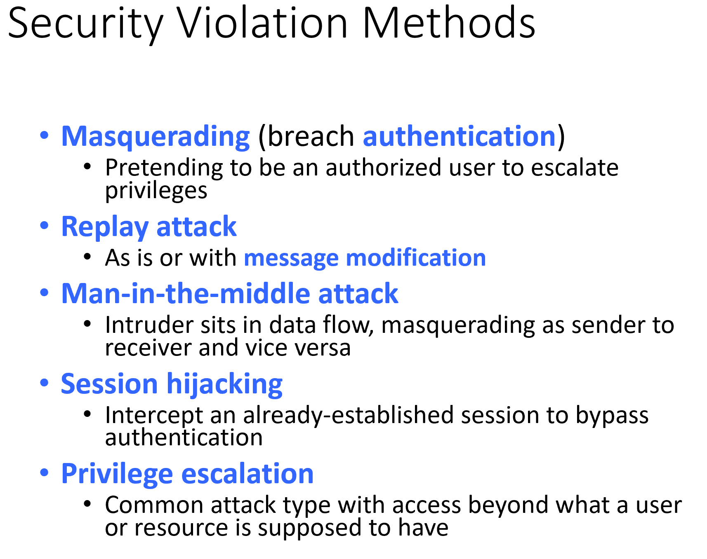
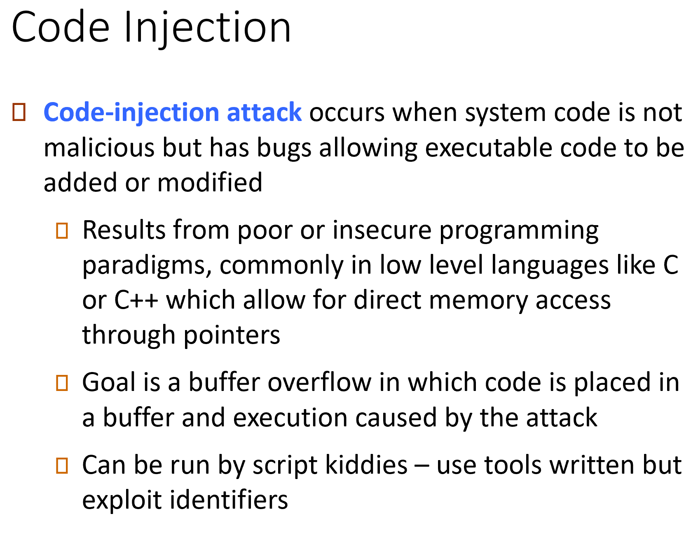
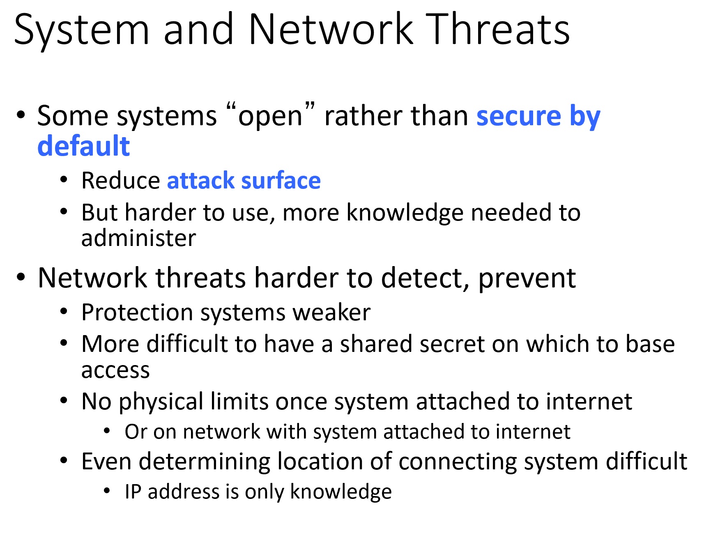
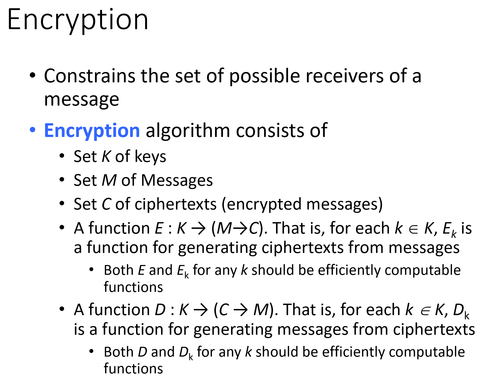
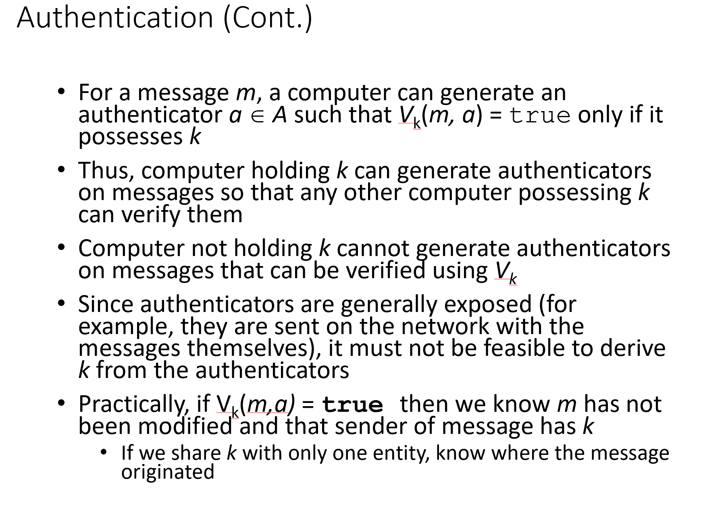
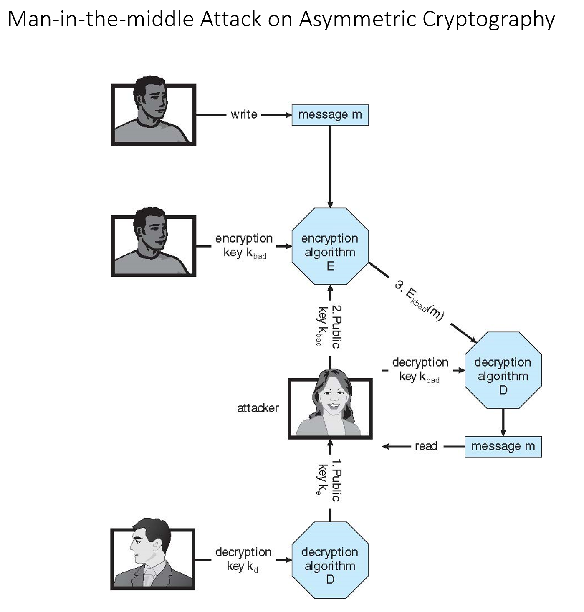

# CMSC412 Lecture 13  
> 10-12  

*Watching October 12, 2023 Panopto lecture*  

## CPU Scheduling Pt. 2

Scheduling fundamentals are the basis of everything that we do in this class

Kernel threads managed by operating systems  
* Processes are mapped 1-1  
* OS manages threads vivisble to it  

User level threads are scheduled by its own process  

There is a portion of the process that does the scheduling  
* One thread that does the scheduling of all others  

Whenever a thread in a user level porocess relinqushes control (wait, term), thread goes into process control  

This threrad decides which one will run next  

When does this thread run?  
* User lvl thread shceudler  

Only when the PCU is allocated to this particular procerss  

User lvl threads run Witihin the time that is allocated to this part. process  

All user lvl scheduler does is shuffle bewtween available ones  

Definie the scope herea as a process scope or a system scope  

If thread is using process scheduling, define scope as such ASOASF  
* Otherwise, scope is system level  

  

Talking about what the scope is. PThreads scope process. Different acitons taken

  

Create theread with all parameters. May deifne wih that the socpe of the thread that we are running AS LONG ASD OP supports it  

  

Basic Idea: What kind of API calls we use to mnake these things happen  

Multiplew processors?  

When we talk abouit processors, upfront, there is a distinciton between homo, asym, or sym processing  

All these are within shared memory  

Question: If we are sacheduled in proc A, and we get blocked, when Wwe come back, should I only be processed to A, or another?  

IOT exec on another porcess, all the info about me must be locally available (Context swithching)
* Are we keeping caches?
  * No, they are local

Therefore, we can run much faster  
* This is the essence of affinity  

If each process is self scheduling, each has its own dispatcher, etc. 
* They base their scheduling on the overall state of the system 
* As long as these data structs are visible, they can take their own decisions 

  

We org. all kinds of queues, S/A the ready queue  

There are multiple processors  

Multi-processing:
* Diff between cores and processors?
  * Cores on same chip
  * Processes on different chip  

Why we care?  
* What is accerssible and available is a question of the memory model  

  

Multi-ptrocessors  

What we want to do is get more and more work done  
* Keep each of the processors busy  
  * Basic scheduling model plays a big part in this (common, per core)

In all these decisions, many factors (affinity, etc.)  

A priori: set strcut thta the balancing of the load is done  

Permit migration of a task form one processor (ready q) to another  
* Pull or push  

Task migration:  
* Apart from doing management, not much that it takes  
  * Very few OS support this  

  

We have on a same physical chip  

Hardware threads  
* Difference is that for system-lvl threads, there is no more scheduling  
* Dynamic info that thread must have
  * Set up registers  
* 4 core 8 thread
  * For every core, there is 2 sets of registers for each thread  

  

Recognize the memory cycle is much longer to the coimputer cycle  

In memory, we exec memory cycle. In CPU, compueter cycle ASOASF  

If we have 2 threads, when one threead blocks, control can be given to the other
* Much faster  

If we have 4 cors on chip and 16 threads, eahc core has 4 sets of register  
* Difference comes in compute:stall ratio
  * Happens on instr by instr basis  

  
From OS view, even though we have 4 cores and 2 threads per core, OS may view it as 8 things to schedule  

  

Memeory at different cores
* Local is fast, sharing is slow  

**N**on **U**niform **M**emory **A**ccess  

We have to take into account the memeopry placeenmt
* Where am IU gonna place the memoruy
* Affinity becomes more important  
* If we are on same processor, using local  
* If we move process ot other processor, may need to copy memory or suffer lowe access time  

  

What does real time mean?  
* Any time computer is interacting with any physical system  

Certain degree of real time cvomes in since timing of physical system is independent of computer tiuming

We can take any process, stop it for x time, start it agaoin with no loss of funcitonality  
* Not true IRL  

In RTS, any processing that ghas to be done, must be done within derfined order of time  

If we have to carry out processing within set amount of time, what info about this process must we know?
* Execution time

RTS require the knowledge of the execution of these tasks be known  

For each task, must know when it starts
* At this time, must know when it will finish  
* Must scheudle before we have deadline  

Usually cyclic tasks  
* examine things over and over  

Make sure they end at their cycle time  

Anytimne we start running any tassk, must go through lkatencies  
* Interrupts occur  
  * Invariable part of what we must do

That time is taken away from processingf time

Soft real time: Must finish by 10, but ok to be late
* Gains penalty with lateness  

Hard real time: If not done by 10, we are FUBAR  
* Crash  

  

This is the basis we use  

All these tasks are started by event that is causing an interrupt  

1. Interrupt processing
2. Dispatch latency (Avoid confliucts)
3. Real time process exec  

Most systems make real-time as a seperate category and give it Very High PriorityTM  

  

For each task, we are given a period  

Scheduler has the support preemtptive scheduling
* Preemptive cus we cant wait for curr taks to complete before going to RT one  

For each task, we know the exec time, the deadline, and the period  

If $t$ == $d$, any problems?
* No  

What if $t$ == $p$?  
* Better dedicate the processor to the particular task. If we take it away at any tiome, will not meet next deadline   

  

When you go to VM env, real-time cannot be done  

  

Strict preemtive priority based scheduling  

The shorter your period, higher priority  

I can take away control from P2 if P1 comes in  
* How often does P1 come in? 
  * See Gantt chart  

  

Combined utilization is 94%  

[Video on RMS](https://www.youtube.com/watch?v=a3XqpyEW3ns&ab_channel=EZCSE)

  

These are the kinds of scheduling that are talked about in RTS  

[Video on EDF](https://www.youtube.com/watch?v=lZdS9offd5s&ab_channel=EZCSE)

  

  

Gives 2 types of scheduling threads for RT  

Which one to use for real time (FIFO or RR)?  
* With RR, how much CPU we get depends on ho many other jobs we get (Not optimal)
* FIFO, we know how many jobs we have (Optimal)

  

  

  

  

Real tiome hasd higher priority  

q == Quantum  

  

  

  

Priorities go from 0-99  

  

  

  

  

Combinign these numbers give the priority  

  

  

IN this table, 59 is the highest priority
* If we give more time to highest priority, defeats the purpose
  * We assign priority based on how long it takes. If it doesn't take too much time, then we give it higher priority since it will be finished sooner  

  

  

  

The models we have seen before are purely theortical; not good for practical applications  

  

  

  

Applicable to braod number of situaitons  

*Look up video*  

  

  

  

## Memory Management  

Appropriate parts of a process must be in memory before it can continue  

Include: 
* Code
* Stack
* Heap
* Control structures
  * Task state seg, etc.

What we dont have access to can be part of the kernel  

Kernel must therefore be in the memory also
* Not necessary to hold the entire kernel
  * If so, should be a mechanicm by whidch the parts of the kernel needed are brought in  

  

  

Cache: Fatser memory access that is used to communicate changes to the CPU  

Keep smaller amount of faster memory next to CPU  

When we are execing and going to operand, we do not care where the op is  

If there is a copy in a faster memory, which HW decides to check if a copy is in the cache or not?  
* Have to have the address. Must keep content and address in cache
  * If it is, we take it
  * If  not, must go to main memory and get it  

How much faster access can we get when we ahve a cahce of a particular size
* Depends on program, cache replacement policies, etc.  

Totally transparent (nice) to the process currently executing  
* Cannot be done in software  
  * If something is done in SW, we exec instrucitons. BUt we are checking for memory in the middle of instructions, therefore we cannot do so in SW  

Assume that all the cache is doing things faster but is still transparent (nice)  

Mem. management, ignore presence of cahc eand focus on main memory  

Main memory that we have in systems have progressed a lot in recent years  

