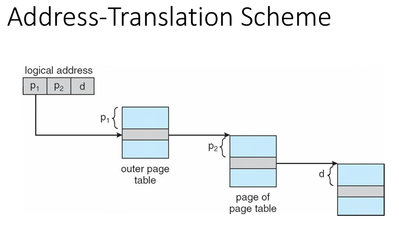
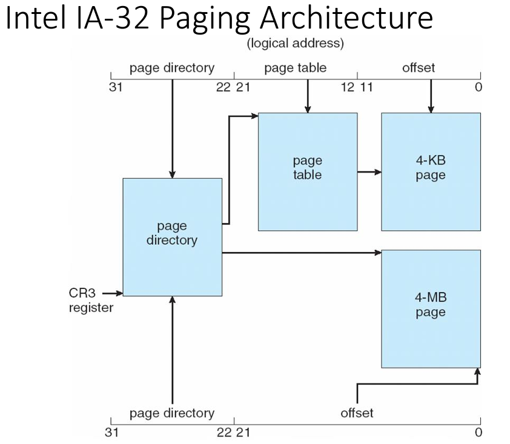

# CMSC412 Lecture 15  
> 10-19  

*Watching October 19, 2023 Panopto lecture*  

**NOTE**: This lecture more or less picks up at the tail of the 2019 lecture, there may be some slides that are not covered here since they were already covered last time

## Memory Management 2 electric boogaloo  

Basic concept: We manipulate address spaces all the time!  

Mapping of addr space from one to other happens as we go along at many different places

Translating one addr to another
* As long as we get a new unique addr for th one we are trying to convert, thats all that matters

Carry on till exec time  

Address translation important!  

Need the mechanism  

Program preparation: Mapping done in software  

Runtime: Translation done using HW  

addr trans: Address treated as individual binary number and contents are the word of the info coming through  

Translation table: We are seeing one base and one limit register
* May have more  
* Point a pointer to it

  

We have a bunch of modules and the language prep parts are treating each module independently

If there are references outside of the modules, they are left as symbolic addresses (module, name, etc.)

Runtime: everything must be resolved  
* All addresses must be resolved to some memory location

Can we retain this structure throughout?  

  

Must we create this linear address space map prior or at execution?  

Normally, prior  
* BY the time we reach execution, we reached linkage editor, references, assigned spaces in linear array, etc.  

BUT, can we do this at runtime?
* What will it take?  

We have to identify the address as 2 parts
1. Segment ID
2. Location in segment

Assume all within-segment IDs start at 0  

  

Many parts to a program  

Treat each as an independent segment  

Makes easer to manage  

  

Whatever the address space is, it is 2D  

Many segments with code within them  
* Linear arrays  

Key limiting factor is the ability to translate them  

  

Logical -> physical  

Each seg. contiguous  

  

This translation is  process by process system  

  

Can we carry out address translation now?  
* NO
* Need the mechanism that finds the segment table and check s < STLR, then add the offset  

Code-sharing: Segment level 
* If provisions done  

Fit the whole segment space of different processes
* Now, fit addr. space of one process but multiple segments  

  

  

For a processes logical address space, they are mapped to phys address space at different location and kept track of in a segment table  

One way: common editor, want to make sure no process has access to any other process
* Specifically, all data kept in different segment  
* Reentrant code: No self modifying instructions, DNH temporary data

If we have a single copy of editor, will the address trans go properly?  
* Must have separate address table  

Depending on which of the two processes is in control, relevant segment table will be used  

Addr. for modifiable portion is in the data portion  

Must every segment of my process be resident @ exec time?  
* No
* If we are executing in seg.1 and using memory in seg. 2 at one time, we don't care about the rest of the segments  
  * ONly if we make refs. to those new segments do we need them to be available  

Our logical address space can become exceedingly large due to this  

LImitations of segmentation: Segments are variable length
* must know it length  

Need to worry about mem management  
* Loading problem (1st fit, worst fit, etc.)  

How to avoid external fragmentation?
* Unused space that is not contiguous 
* Come up with structure that all broken spaces could be filled, then we could do so. 

internal frag
* Unused pace within allocated block  

1. split phys memory into segments
2. Make sure every segment is of same size 
3. Each segment will occupy all the holes  

THis is good, but will result in internal fragmentation  

How to avoid this?  

Decrease size of each block, more pages needed  
* This results in les internal frag  

  

View the linear address space as a sequence of blocks of equal size  

~32:00 He starts writing on the board about Logical address space and how to index through them  

  

  

  

  

All we do is that the COU issues an address which we will break up at runtime
* Programmer DN need to know about paging in that system  

Knowing that we hve paging *can* be beneficial, but is mostly fine to not know  

  

  

  

Need to keep track of free frames in memory management  

If thee are not enough free frames, we simply don't load or create space
* Get rid of some of the allocated spaces

  

For each memory reference, we may need to go into he memory twice    

When we execute programs, we normally do them sequentially  
* must we go to the page table for every one of the instructions?
  * Instead, save our spot in the translation and go from there  

  

These are usually not very large  

Separate one for every process?  
* Page number will keep process ID for where its from  

TLB is implemented as part of the CPU  

How o we find if there is a page number in there or not  

Need to do it fast enough to justify its existence

Anytime we go to main memory, we keep a copy of the page that was just fetched with page and page frame number  

  

  

HWW implementation that looks up based on content, NOT address  

Simultaneously checks all page numbers in assoc. memory 
* If there is a match, supplies page number  

Since HW, very expensive  

  

*Look up video*  

Issued to go to min memory  

  

*Look up video*

The reason why we do double the time for a miss is because we need to check for a hit through the entire memory. If it's not there, we need to update the entire memory, yielding another run through the memory  

By having the TLB, we can decrease th penalty  

***~55:00***

  

Done on Page-byPage basis  

Need to worry if the page is there or not  

If not in logical address space, called page fault  

  

  

For paging, we can support very large address space  

  

  

We have an editor that is 2k bytes long  

when process rqs. editor, it is making a ref within the process to 1100  

This is hardcoded  

The addresses when this is compiled, it is bound as address number xyz  

  

In the address space of each process, any shared code must be in the same location  

IN the page table, the first three entries are common  

If here are any mem refs within process, will be done correctly  

How to ensure this?  
* Reserve the upper half of address space as common  

All shared code could now share the relevant code  

  

Problem: If we have 2^32 address space and 4K pages, page space can be up to 4 million!!  

4 mil * 4bytes = 16million per process  

 

Page the page table  

  

  

How many page tables do we require? 
* 12 

  

Take higher order and index the outer page table  

Entry in outer page table down p1 gives the beginning for p2 which in turn gives us the physical address  
* Getting the addresses depends on the offsets given  

How many times will we need to go to memory?
* 3 times  

EAT depends on hit ratio
* HR for outer
* HE for inner

If hit on outer and inner, EAT is 1

  

  
We may have to go into memory up to 4 times  

  

  

  

*Look up*  

What we start with is the page frame number and ID

For every page frame in the inverted page table, need to search and find if this entry appears anywhere  

Has not been implemented according to prof

  

  

  

Segmentation with paging:  
* Segment table, then look up page  

  

  

  

  

  

  
