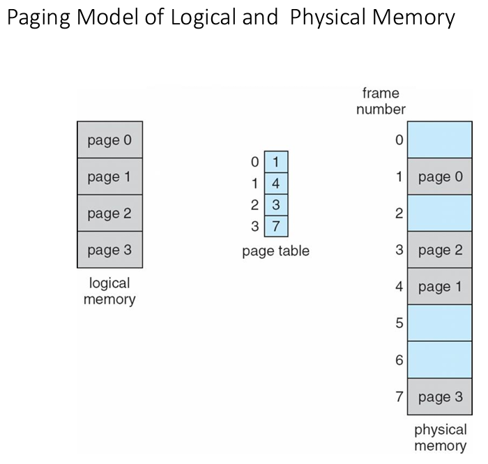
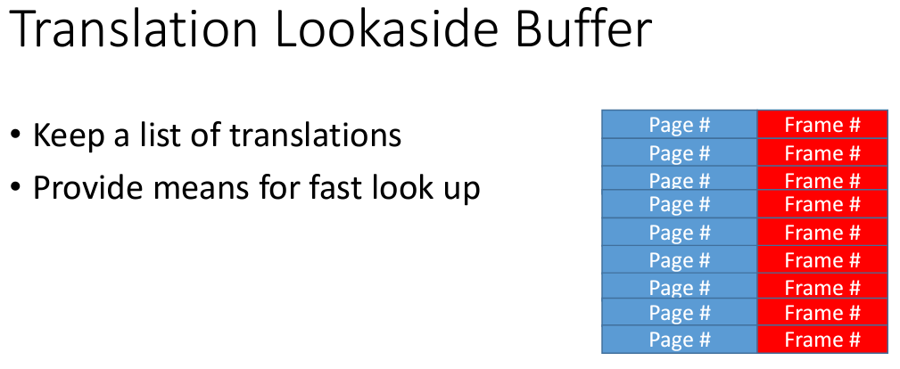
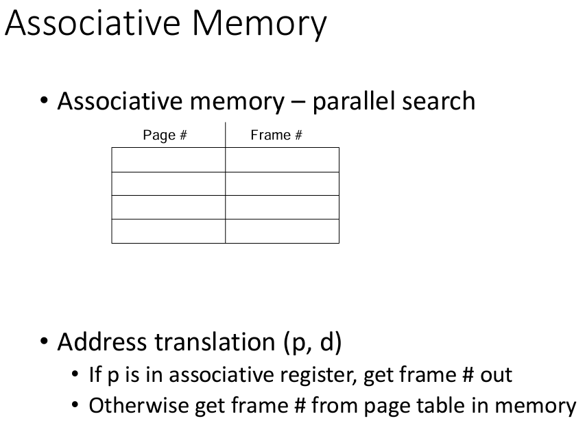
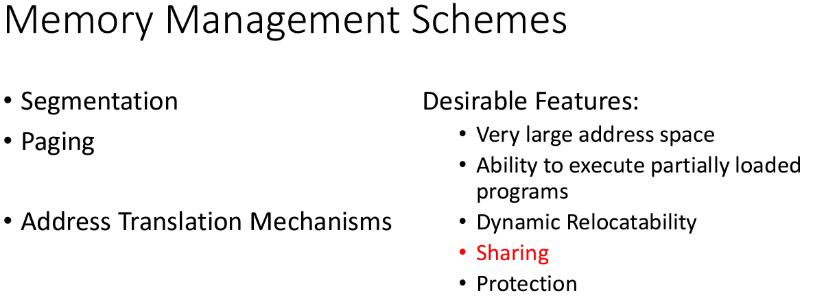
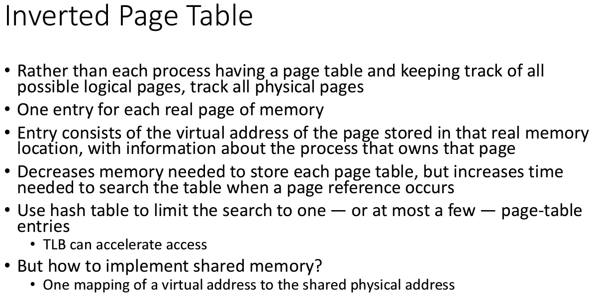
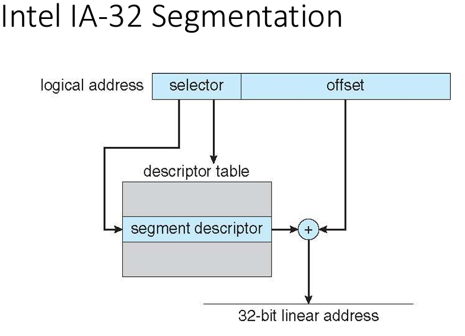

# CMSC412 Lecture 13  
> 10-19  

*Watching October 19, 2023 Panopto lecture*  
**NOTE**: This lecture more or less picks up at the tail of the 2019 lecture, there may be some slides that are not covered here since they were already covered last time

## Memory Management 2 electric boogaloo  

Basic concept: We manipulate address spaces all the time!  

Mapping of addr space from one to other happens as we go along at many different places

Translating one addr to another
* As long as we get a new unique addr for th one we are trying to convert, thats all that matters

Carry on till exec time  

Address translation important!  

Need the mechanism  

Program preparation: Mapping done in software  

Runtime: Translation done using HW  

addr trans: Address treated as individual binary number and contents are the word of the info coming throuhg  

Translation table: We are seeing one base and one limit register
* May have more  
* Point a pointer to it

  

We have a bunch of modules and the language prep parts are treating each module independently

If there are references outside of the modules, they are left as symbolic addresses (module, name, etc.)

Runtime: everything must be resolved  
* All addresses must be resolved to some memory location

Can we retain this structure throughout?  

  

Must we create this linear address space map prior or at execution?  

Normally, prior  
* BY the time we reach execution, we reached linkage editor, references, assigned spaces in linear array, etc.  

BUT, can we do this at runtime?
* What will it take?  

We have to identify the address as 2 parts
1. Segment ID
2. Location in segment

Assume all within-segment IDs start at 0  

  

Many parts to a program  

Treat each as an independent segment  

Makes easer to manage  

  

Whatever the address space is, it is 2D  

Many segments with code within them  
* Linear arrays  

Key limiting factor is the ability to translate them  

  

Logical -> physical  

Each seg. contiguous  

  

This translation is  process by process system  

  

Can we carry out address translation now?  
* NO
* Need the mechanism that finds the segment table and check s < STLR, then add the offset  

Code-sharing: Segment level 
* If provisions done  

Fit the whole segment space of different processes
* Now, fit addr. space of one process but multiple segments  

  

  

For a processes logical address space, they are mapped to phys address space at different location and kept track of in a segment table  

One way: common editor, want to make sure no process has access to any other process
* Specifically, all data kept in different segment  
* Reentrant code: No self modifying instructions, DNH temporary data

If we have a single copy of editor, will the address trans go properly?  
* Must have separate address table  

Depending on which of the two processes is in control, relevant segment table will be used  

Addr. for modifiable portion is in the data portion  

Must every segment of my process be resident @ exec time?  
* No

If we are executing in seg.1 and using memory in seg. 2 at one time, we don't care about the rest of the segments 

  

  

  

  

  

  

  

  

  

  

  

  

  

  

  

  

  

  

  

  

  

  

  

  

  

  

  

  

  

  

  

  

  

  

  

  

  

  

  
