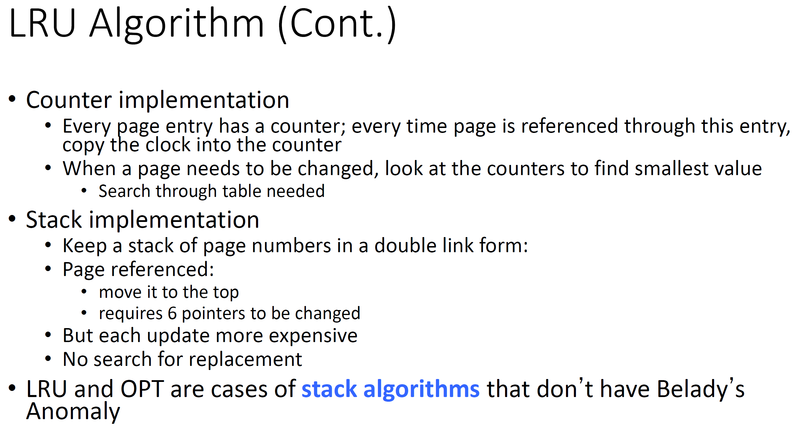
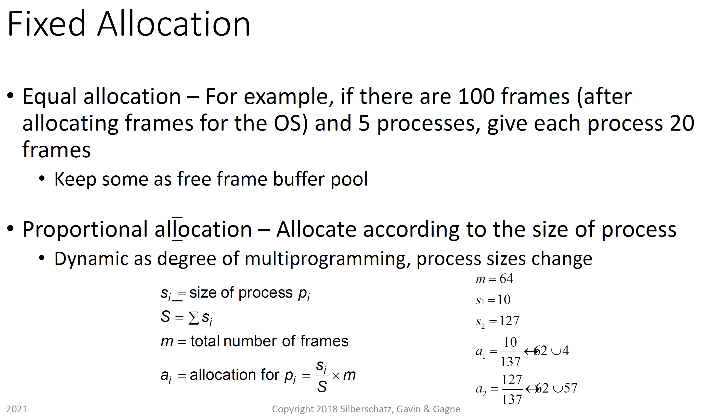
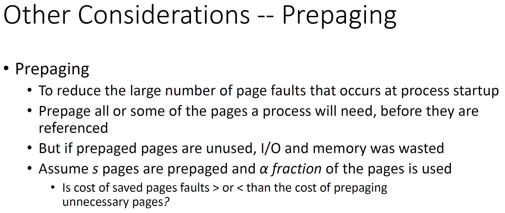

# CMSC412 Lecture 16  
> 10-24  

## Virtual memory  

  

We have to recognize whats going on  

WHole program must be in memory  

If we make provision so tht without havnig whole program in mem @ exec, we could still crry on with execution of programs  

Starting point: Ability to execute partilly loaed programs

decouploing the address space that a program is structured in and the physical address space  

  

By mapping at runtime, can decouple the two 

WHy do we need logicla address space to be larger?  
* We as programmers need to facilitate any bloating that occurs  
* Typically, the demand we place we put on emmeory doubles every 3-5 years  
* OUr ablilty to have that much memory on phycisal hardware cannot keep up with demand  

Are we wasting this spce in virtaul memory space?  
* We are writing  in higher level language that is then translated to machine language
  * Adds overhead  
* Can always write smaller languages, but requires lower-level languages  

Raspberry Pi and Arduino have pretty large memories but still require tight code  

If wiritng in higher -lvl lagnuages is inefficietn, why do we sill use them?
* Human factor: human efficiency is important  

Whatever time we leave on the table is made up for in how well humans can write code thanks to modern programming languages  

  

Virtual address space: All that the compilers are dealing with  
* Address spaces

Everything is with respect to an address space  

We want to have an address sapce to bemappped in th end  

Maintainning tables is one way to do address translation  

What do we keep in memory?
* up to implementation  

  

Even when we are talking about virtual address sapc, it needs to exist somewhere
* USually secondary storage  

From which, whenever we needany part, we take it in  

The full copy of virtual memory space exists on the secondary storage  

We should be able to bring back in from secondary into physical emmory  

  

What wre we doing at the beginnnign?

Bring in entire process and swap entire space when we have a new process  

   

Shared in 2 virtaul address spaces  

SHared paces must be reentrant and occupy same spaces in virtual spaces  

  

When we do this kind of swapping, due to the address space needint to be contiguous, we could get external fragmentation  

Even though total amoun of free space is larger, since it is not contiguous, we cannot make use of it  

  

We load a page only when a reference to the page is made  

I/O to secondar storage is significantly slower  

When is a page needed?  
* When a reference is made to it  

Wht kind of address does the exec of a program require?
* Bring instruction in, operands, store operands in emmroy  

This instruction, while it is executing, try to get an operand 
* Operand not in operand? Cannot cnotinue  
  * Page fault occurs in the middle of execution  
* Must repeat instruction by rolling back state to the beginning of instruction

Interrupt detected in HW
* Done by the MMU  

***21:40***

  

We assume in our programming that any programs can be soppedat anytime for anyamount of time w/o consequence  

  

Each page table entry has vlid-invalid but and the frame number  

page table has an enry for every page in virtual address space  

If page from virtual emmory spac is not in memory, must keep track in page table  

  

  

First reference?  
* When you reference firsts time and its not there, page comes in.
  * Causes page fault

A page for every emroy space, but just because we can address many places, our programs rarely are  

Free page frammes
* Page frame that does not belong to any procss
* trakced by mmu  

STate of machine that has to be saved is as if it was at the beginning of execution of the instruction  
* what has changed?
  * Program counter has been incremented, so must restore  

If any registers have been modified, must bring them back  
* Done by HW when page fault occurs  

State of process saved at any interrupt  

  

1. Start with instruction load m
2. Go to page with invalid bit
   1. Causes trap
3. Goes to OS, OS decides whether its a valid ref
4. Page not in memory, find in secondary storage 
How can it find it?  
* Keep track of this
  * Various techniques  

5. Issues read request  
6. page frame modified  

  

How do we strt the process?  

pointer is on first instruction to execute, not in memory  

For every other process page on firt access, have a page fault  

Pure demand paging  
* Look up  

Instrution can execute multiple pages
* What happens here?

the 2 numbers could be in 2 different pages  
* Storing back somewhr another reference  

Executing an instructoin
* where instruciton ws on a page in memory  

Fecth and decode, issue reference to first opertor  

Page fault means we go back to beginning  

ONce we have done this enought to bring the arguments in, we can continue  

One instruction can lead to multiple page faults!  

Page faults: Very expensive
* However, most programs we write only execute small portion of code at a time sequentially  
* first instrucion on page, has 512 byte, 1024, etc. 
* next instruction then pages there
* Locality of reference (look up)
* 
  

If we do a block move, and go to a location not on a page that is in mmory
* Restart?  
* or save state of insatruciton in the middle?

Depends on machine supporting partially executed programming  

 

Getting rid of disk IO would greatly enhance performance  

  

  

Page fault rate depends on smaller memory, smaller amount of pages, and locality  
* Amount of physical memory given to process
* Depending on how effective replacement poilcy  
***51:00***

  

  

  

  

  

  

  

  

  

  

  

  

  

  

  

  

  

  

  

  

  

  

  

  

  

  

  

  

  

  

  

  

  

  

  

  

  

  

  

  

  

  

  

  

  

  

  

  

  

  

  

  

  

  

  

  

  

  

  

  

  

  

  

  

  

  

