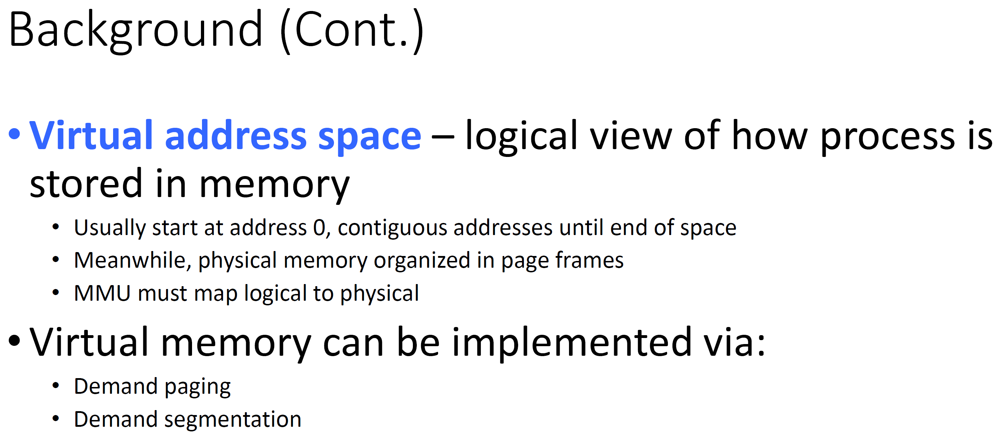

# CMSC412 Lecture 16  
> 10-24  

## Virtual memory  

  

We have to recognize whats going on  

WHole program must be in memory  

If we make provision so tht without having whole program in mem @ exec, we could still carry on with execution of programs  

Starting point: Ability to execute partially loaded programs

Decoupling the address space that a program is structured in and the physical address space  

  

By mapping at runtime, can decouple the two 

WHy do we need logical address space to be larger?  
* We as programmers need to facilitate any bloating that occurs  
* Typically, the demand we place we put on memory doubles every 3-5 years  
* Our ability to have that much memory on physical hardware cannot keep up with demand  

Are we wasting this space in virtual memory space?  
* We are writing  in higher level language that is then translated to machine language
  * Adds overhead  
* Can always write smaller languages, but requires lower-level languages  

Raspberry Pi and Arduino have pretty large memories but still require tight code  

If writing in higher-lvl languages is inefficient, why do we sill use them?
* Human factor: human efficiency is important  

Whatever time we leave on the table is made up for in how well humans can write code thanks to modern programming languages  

  

Virtual address space: All that the compilers are dealing with  
* Address spaces

Everything is with respect to an address space  

We want to have an address space to be mapped in the end  

Maintaining tables is one way to do address translation  

What do we keep in memory?
* up to implementation  

  

Even when we are talking about virtual address space, it needs to exist somewhere
* USually secondary storage  

From which, whenever we need any part, we take it in  

The full copy of virtual memory space exists on the secondary storage  

We should be able to bring back in from secondary into physical memory  

  

What wre we doing at the beginning?

Bring in entire process and swap entire space when we have a new process  

   

Shared in 2 virtually address spaces  

SHared paces must be reentrant and occupy same spaces in virtual spaces  

  

When we do this kind of swapping, due to the address space needing to be contiguous, we could get external fragmentation  

Even though total amount of free space is larger, since it is not contiguous, we cannot make use of it  

  

We load a page only when a reference to the page is made  

I/O to secondary storage is significantly slower  

When is a page needed?  
* When a reference is made to it  

Wht kind of address does the exec of a program require?
* Bring instruction in, operands, store operands in memory  

This instruction, while it is executing, try to get an operand 
* Operand not in operand? Cannot continue  
  * Page fault occurs in the middle of execution  
* Must repeat instruction by rolling back state to the beginning of instruction

Interrupt detected in HW
* Done by the MMU  

***21:40***

  

We assume in our programming that any programs can be stopped anytime for any amount of time w/o consequence  

  

Each page table entry has valid-invalid but and the frame number  

page table has an entry for every page in virtual address space  

If page from virtual memory space is not in memory, must keep track in page table  

  

  

First reference?  
* When you reference firsts time and its not there, page comes in.
  * Causes page fault

A page for every memory space, but just because we can address many places, our programs rarely are  

Free page frames
* Page frame that does not belong to any process
* tracked by mmu  

STate of machine that has to be saved is as if it was at the beginning of execution of the instruction  
* what has changed?
  * Program counter has been incremented, so must restore  

If any registers have been modified, must bring them back  
* Done by HW when page fault occurs  

State of process saved at any interrupt  

  

1. Start with instruction load m
2. Go to page with invalid bit
   1. Causes trap
3. Goes to OS, OS decides whether its a valid ref
4. Page not in memory, find in secondary storage 
How can it find it?  
* Keep track of this
  * Various techniques  

5. Issues read request  
6. page frame modified  

  

How do we start the process?  

pointer is on first instruction to execute, not in memory  

For every other process page on first access, have a page fault  

Pure demand paging  
* Look up  

Instruction can execute multiple pages
* What happens here?

the 2 numbers could be in 2 different pages  
* Storing back somewhere another reference  

Executing an instruction
* where instruction ws on a page in memory  

Fetch and decode, issue reference to first operator  

Page fault means we go back to beginning  

ONce we have done this enough to bring the arguments in, we can continue  

One instruction can lead to multiple page faults!  

Page faults: Very expensive
* However, most programs we write only execute small portion of code at a time sequentially  
* first instruction on page, has 512 byte, 1024, etc. 
* next instruction then pages there
* Locality of reference (look up)
* 
  

If we do a block move, and go to a location not on a page that is in memory
* Restart?  
* or save state of instruction in the middle?

Depends on machine supporting partially executed programming  

 

Getting rid of disk IO would greatly enhance performance  

  

  

Page fault rate depends on smaller memory, smaller amount of pages, and locality  
* Amount of physical memory given to process
* Depending on how effective replacement policy  

Less page faults will occur when we prioritize the pages that are cesses the most  

Whatever page was requested, we need to bring it in  

If there is a page not to be references at all and we toss it, not consequences  

The page that is used longest time in the future is tossed, will give better performance  

  

If a page is to be tossed, do we write it back?
* No  

  

  

  

  

Want to reduce the EAT that minimizes number of page faults  

  

Anytime you write to page, modify bit is carried over  
* Tells us if a page has been modified  

If not modified, copy already exists  
* replacement policy will use this bit  

  

  

Which free frame to use when found does not really matter  
* Doesn't make a difference in the end  

  

  

*Look these up*  

Ref string: Page numbers important  

