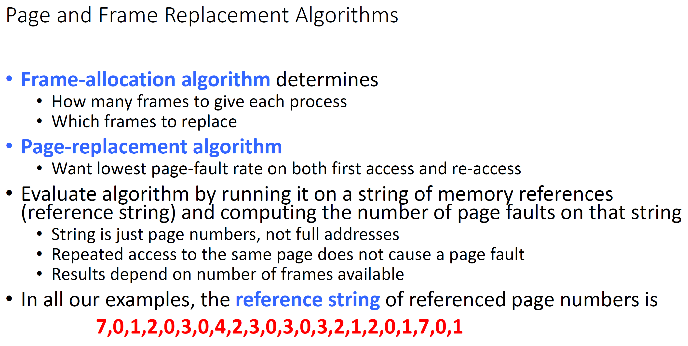
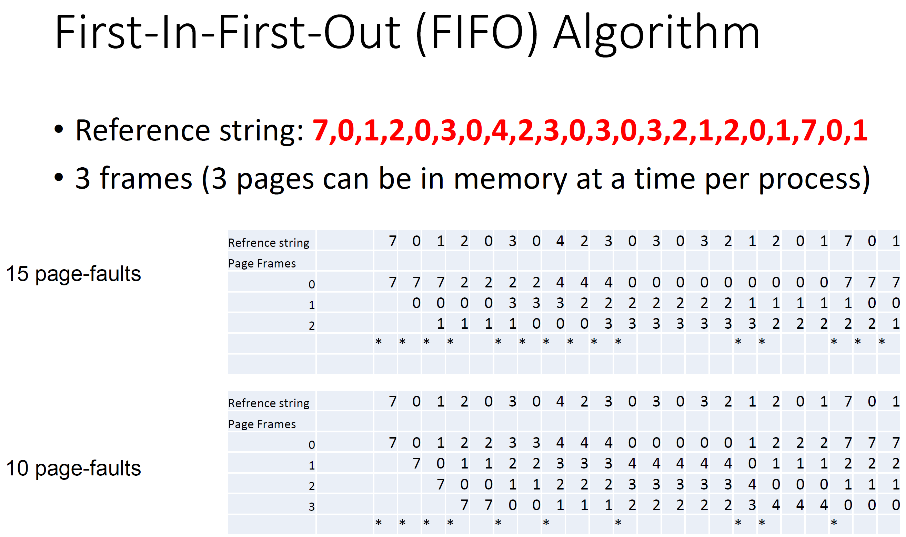
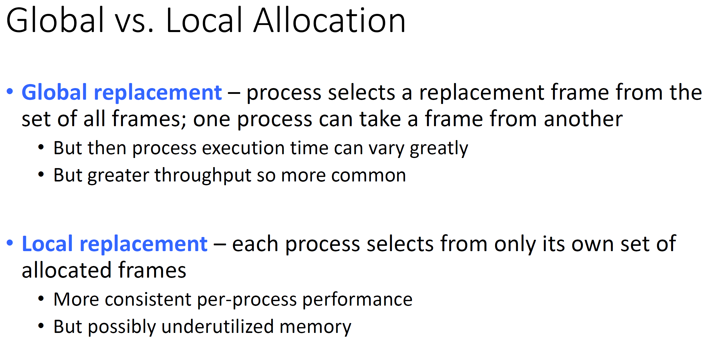
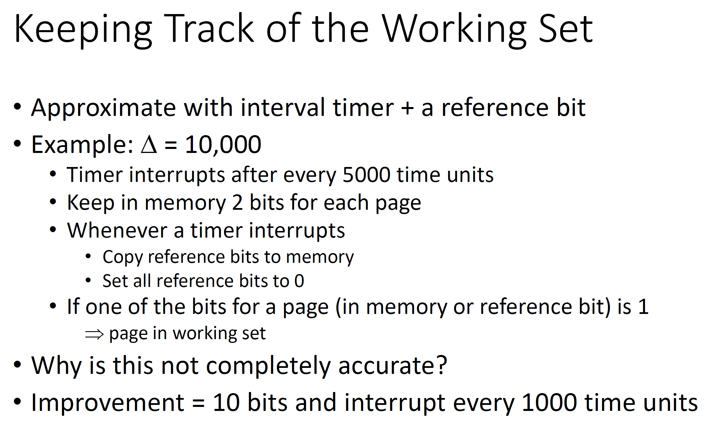
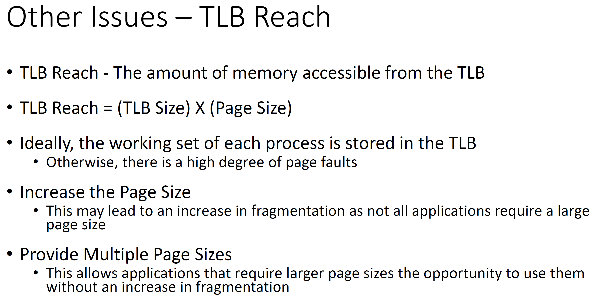
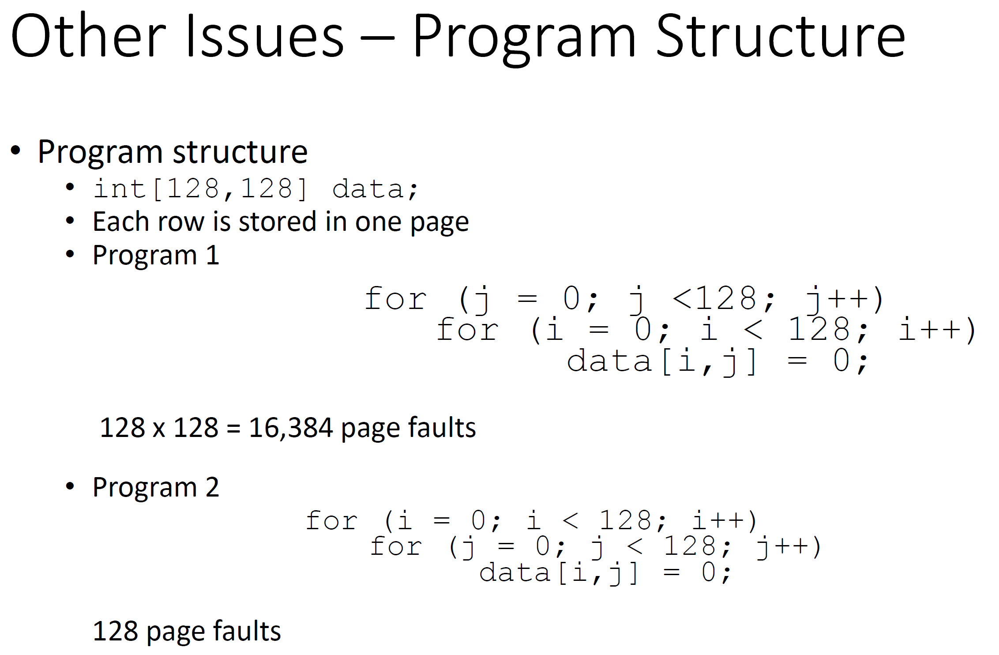
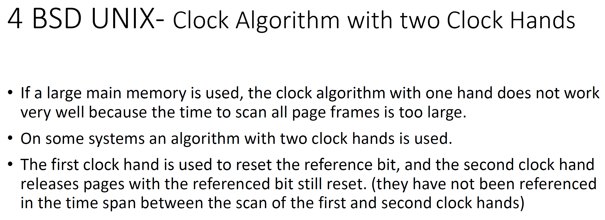
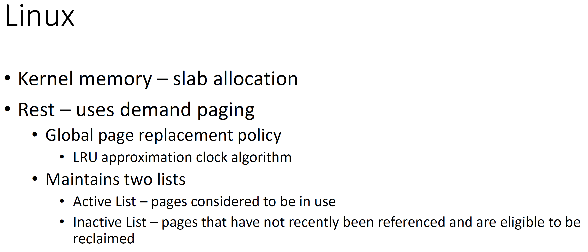
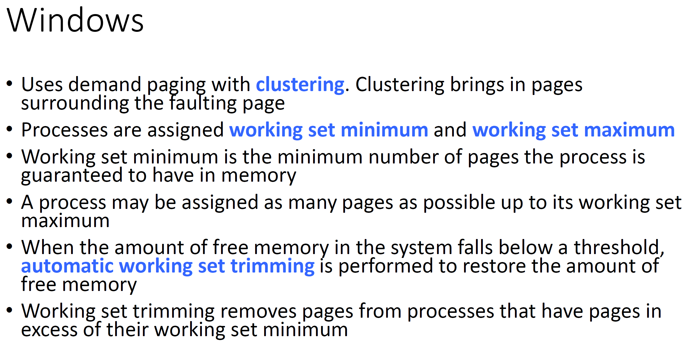

# CMSC412 Lecture 17  
> 10-26  

## Virtual memory 2 electric boogalo
yeah i know i made that joke before kiss my ass 

  

Basic issue: page replacement algorithm  
* Ibjective: page access time is dependment on page fault rate  
  * Want to reduce this given same noumber of ages existing

We start with reference string that identifies page numbers  

Given algo, how will it act  

  

More memory, less page faults  

  

How to asses? 

There ar 3 page frames avaialable  

Anytime we need to roll in a page (replace) mark as page fault with star  

First 3 are all page faults since the frames are all empty at first  
* 4th is a page fault since 2 does not exist  
* We continue replacing the oldest number that exists within the frames until the reference string has been satisfied  

  

Anomaly of *FIFO* systems  

  

  

Here, we first have the 3 essential page faults. After this, we have 2 trying to butt in. Out of 7, 0, and 1, which one should be replaced?  

* 1 is used 12 steps away
* 0 is used after this step
* 7 is used 16 steps away  

Therefore, we'd replace 7, since we won't use it for a long time  

REMEMBER: This is merely a measure of how well your algorithm works, and cannot be implemented IRL (you cant see the future)

You continue, doing the same process whenever you encounter a page fault  

In the ref string,how many essential faults are there?  
* Determine how many different paes are there in page string
  * IN our example, there are 6 (0,1,2,3,4,7)
  * We MUST have a page fault for each of these (They have to be brought in for the first time at some time during all this)  

  

As we increase memory (page frames), we have the same amount of page faults or less  

  

First three are essential faults  

When 2 wants to join the party, we look through our frames and see when they were used  

* 1's frame was just used
* 0's frame was used 1 step ago
* 7's frame was used 2 steps ago  

Therefore, we replace with 7's frame  

We can therefore treat this as a stack, whereby we add the new number on the top, pushing the bottom one out if necessary  

Suppose we had 4 page frames  
* We still maintain frame order  
* Pulling any new page on top  
  * If already there, put it on top  

If we have 2 instead of 3, what would the stacks look like?  
* No lol  
* All we are doing is changing the depth of the stack 
* By adding more frames, we only impact the bottom elements  
* This is why it results in equal or better performance only  

Where do we mainain this?   

  

  

I fell aslepp LUL
  

  

  

  

  

  

  

  

  

  

  

  

  

  

  

  

  

  

  

  

  

  

  

  

  

  

  

  

  

  

  

  

  

  

  

  

  

  

  

  

  

  

  

  

  

  

  

