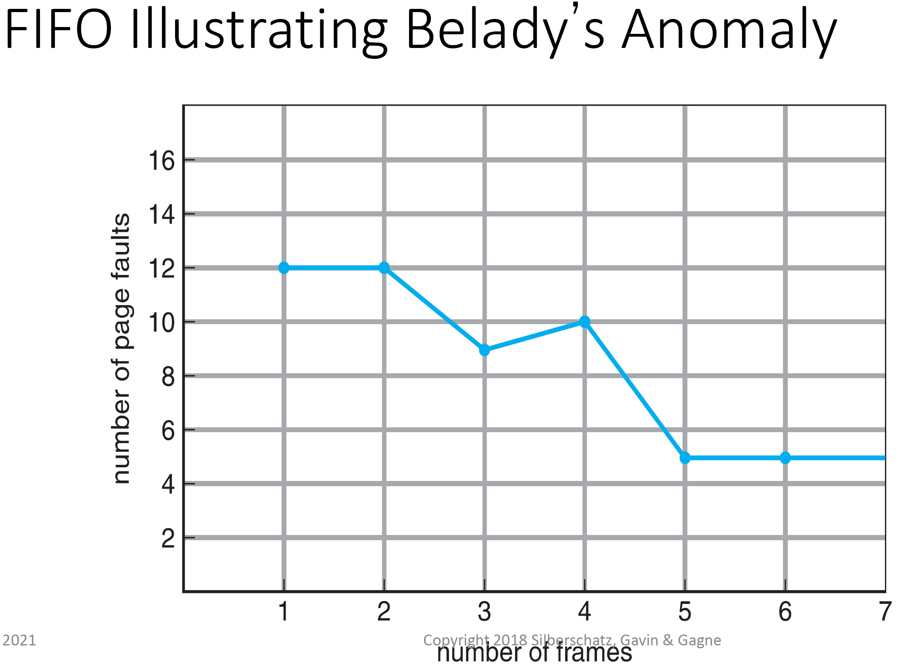
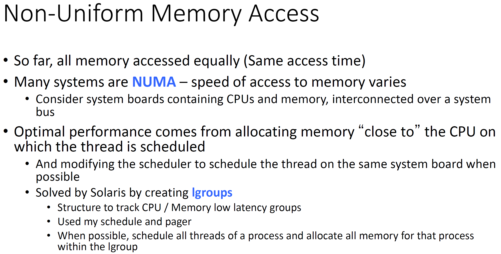
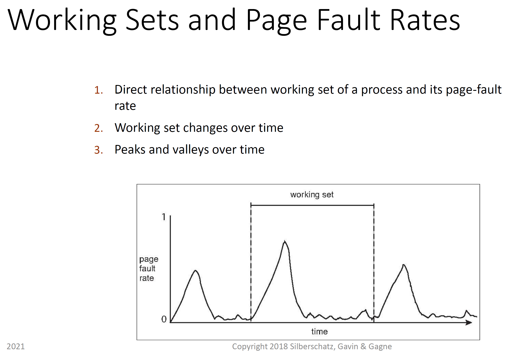
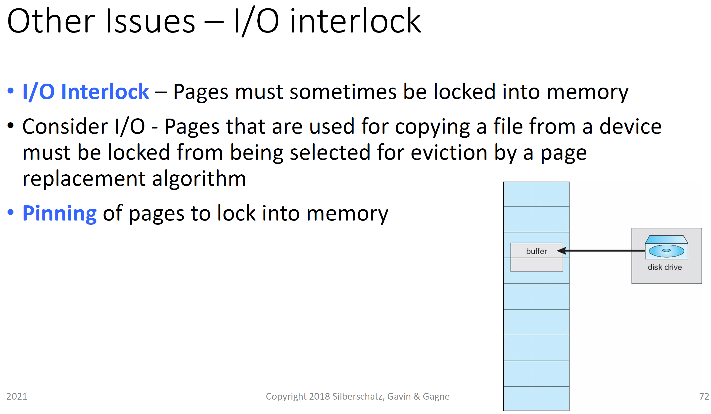
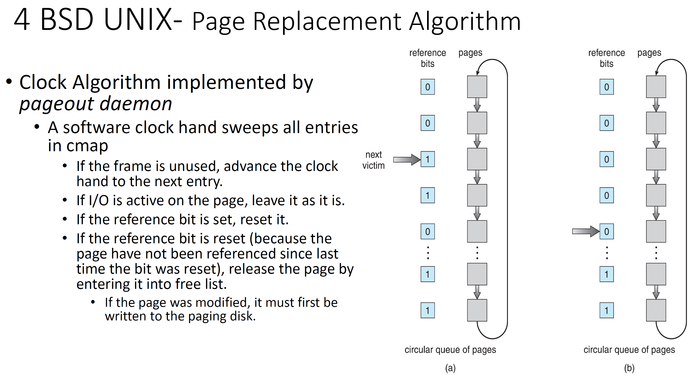
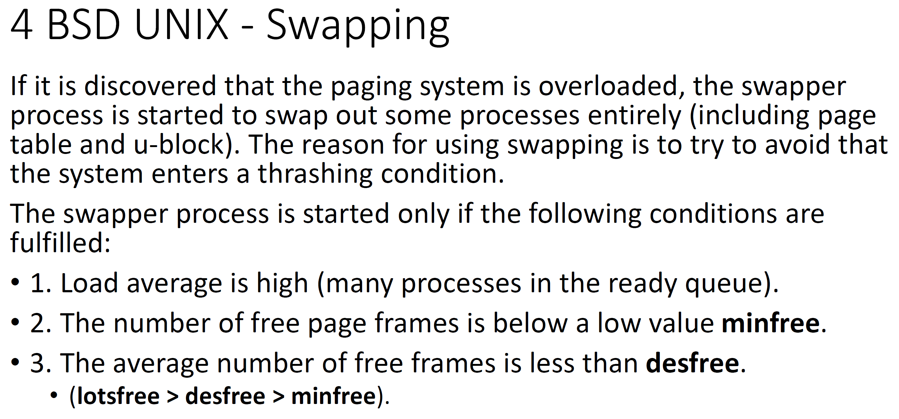
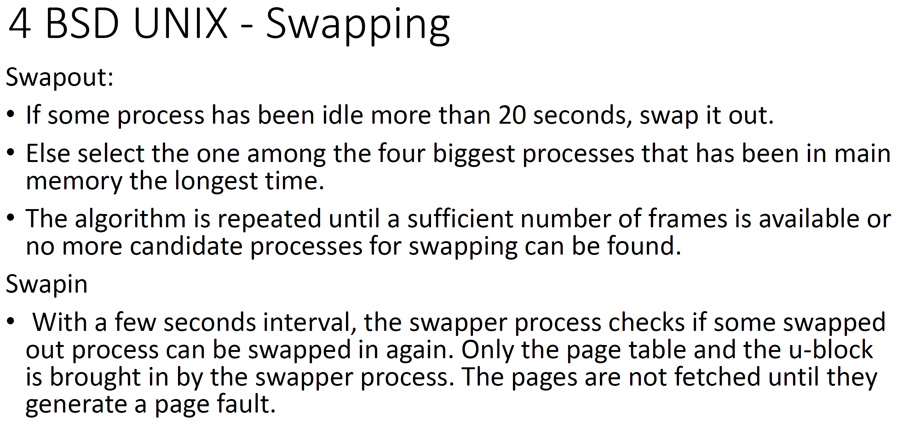
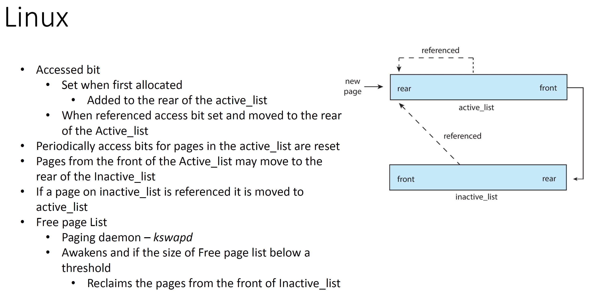
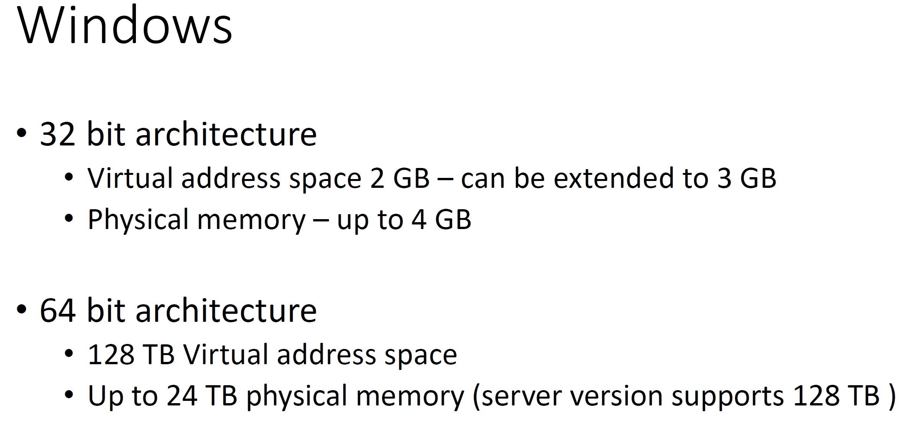

# CMSC412 Lecture 17  
> 10-26  

## Virtual memory 2 electric boogalo
yeah i know i made that joke before kiss my ass 

  

Basic issue: page replacement algorithm  
* Ibjective: page access time is dependment on page fault rate  
  * Want to reduce this given same noumber of ages existing

We start with reference string that identifies page numbers  

Given algo, how will it act  

  

More memory, less page faults  

  

How to asses? 

There ar 3 page frames avaialable  

Anytime we need to roll in a page (replace) mark as page fault with star  

First 3 are all page faults since the frames are all empty at first  
* 4th is a page fault since 2 does not exist  
* We continue replacing the oldest number that exists within the frames until the reference string has been satisfied  

  

Anomaly of *FIFO* systems  

  

  

Here, we first have the 3 essential page faults. After this, we have 2 trying to butt in. Out of 7, 0, and 1, which one should be replaced?  

* 1 is used 12 steps away
* 0 is used after this step
* 7 is used 16 steps away  

Therefore, we'd replace 7, since we won't use it for a long time  

REMEMBER: This is merely a measure of how well your algorithm works, and cannot be implemented IRL (you cant see the future)

You continue, doing the same process whenever you encounter a page fault  

In the ref string,how many essential faults are there?  
* Determine how many different paes are there in page string
  * IN our example, there are 6 (0,1,2,3,4,7)
  * We MUST have a page fault for each of these (They have to be brought in for the first time at some time during all this)  

  

As we increase memory (page frames), we have the same amount of page faults or less  

  

First three are essential faults  

When 2 wants to join the party, we look through our frames and see when they were used  

* 1's frame was just used
* 0's frame was used 1 step ago
* 7's frame was used 2 steps ago  

Therefore, we replace with 7's frame  

We can therefore treat this as a stack, whereby we add the new number on the top, pushing the bottom one out if necessary  

Suppose we had 4 page frames  
* We still maintain frame order  
* Pulling any new page on top  
  * If already there, put it on top  

If we have 2 instead of 3, what would the stacks look like? Would anything change?  
* No lol  
* All we are doing is changing the depth of the stack 
* By adding more frames, we only impact the bottom elements  
* This is why it results in equal or better performance only  

Where do we maintain this?   

This is generally a good method for page replacement, and used often  

These algos are also called stack algos  
* Where do we maintain the stack in this case?
* Will be answered later on  

  

  

For every ref., only making change in one entry of the page table
* Add one more column that keeps track of this counter
  * Anytime ref is made, copy counter value into this new column

Search only done when page page replacement is required  

Page replacement is time consuming anyways, so can afford add this function  

Stack implementation to avoid search done in counter implemenation  

No earch for replacement: WHatever is at the bottom, just pick that up  

**TLDR**  
*Counter ~~Strike~~ implementation*  
* For evyr ref, min amount of work (copy counter)
* Morework when replacement neees to be done (Search for smallest counter, etc.)
*Stack implementation*  
* For every page ref, retsructure linked list
* Work for page replacement is minimal  

  

Here, we are making a reference to 7. Therefore, we move 7 to the top and shift the rest of the pages "down"  

  

For any of these approached, new HW req.  

Sonce the ref bit is init'd to 0, all those pages that have 0 for that bit have not been refrenced yet.  
* note that this is only an approximation becasue we do not know the order in which they were ref'd  
* Very little additional work needed  
  * Kinda similar to the clock algo  
  * In clock algo, need to read the clock (sys call sometimes, leding to overhead)

2nd chance: 

  

 *Video on 2nd chance algo*  

 Basically, when a page gets refrenced, you set the bit. WHen it comes time for page replacement,if a page is set to be replaced BUT it has the refrence bit, it gets a "2nd chance" and does not get replaced  

  

Modifyed bit: When a bit is modified instead of being refrenced  

Obj: Come up with the ways to implement reasonable things using the knowledge we have currently  
* Clock scheme  

  

These two algorithms represent two schools of thought  
* Neither are really used though  

  

Bullet 2:  
When backing store not busy, keep writing on 2nd storage and mark as clean pages, since copy on secondary storage i same as copy in memory  

Mark some pages as free frame, but have not modded them  

We know where it belongs
* If used, link it from free-page list  
* Early UNIX hused this in the past  

  

IO done for page done to OS
* From OS, copies to user memory space  
  * 2 copies of page  

Takes time to perform these actions  

Mem to mem operations happen to facilitate this  

  

How many are minimum number of pages to give?  
* Pure demand paging: 0
* maximum: Alloc all pages in virtual address space

  

Once we have alloc'd 20 pages to process, replaces from within it's allocated space  

If we're running a prog with this proporitonal allocation, how can we make it run better?  
* No page faults?  

Say the content for prog. is in 5 pages  
* Declare array for 200 pages  
* OS thinks process siz is 205
* Allocs more pages than needed
* MOre than 5, all actula pages using will be in emmory and run fast  

  

  

Global: Finding pag to replace, replace it from ny and every page in memory  

Local: fixed set of frames allocd to me, and replace content of content of one of those page and this ???  

What happens in global replacement? 
* Taking pages from some process
  * May eb in ready qyeye
  * NOt currently active
  * Gives beter throughput  

LOcal
* underutilized memory 

  

Before: Assume wherever a page frame is, accesss time is the ame  

Interacitons betwwen scheduling and mem management  

Where threwad is run == may inporve memory access  

  

  

  

More proceses, we eventually collapse

Eveyr process that can run in ready queue runs for very short time then page faults  

Most processes are waiting for page faults  

Thrashing occurs when we get lots of page ffaults  

  

Anytime we are executing, we do i in a locality  

When in 1, size definded by # pages belonging to th locality  

If procsess has all pages in memory, for duration that pricess is in locality, no page faults  

  

If we knew wha the currentworking set (pages we need rn), we can do a god job  

How to define working set?  

Which pages will be refed in the furture  

  

At any time instant, look at how many pages have we refrenced in some time period  

This leas to the connection with mulitprogramming  

Hwo do we know thrashing is occuring?  
* OS need to track page fault rate  

  

Ans: Only keeping traxkc of one refeerence  

  

must be done on process by process bassis  

  

Goes up due to change in locality  

  

Last bullet: Done when we write back to the disk

  

Kernel has to stay in memory  

Kernel is not allways in memory
* SOmetimes in free memory piool  

Why must device IO memory be contiguous?  
* Becsue od the DMA transfers, disk controller writes to phys address (usually next one). 
* Addressing done by disk has no knowledge of virt address space
  * doing it to memory dierct;y and in squential memeory space  

If on page frame bourndary, those page frames must stay in memory as IO continues  

  

  

  

  

Look up slab allocation  

  

  

  

Allocate and preload certain number of pages?
* Pro: IO is faster than doing bullk IO  
  * Right kind of pages in memory, page faults will go down  
* COn: May bring in pages that ar never used

Most modern OS's do not use this  
* Given set of pages  

  

What should be the page size?  
* ^ , smaller page table size  
* Biggest cost: seek time & rotational delay  
* Page faults decrease  
* Locaity sizegoes down 

  

All those pages whosw entries are in the TLB we do not pay th pealty of reading the page tbale from memory  
* in single acces, can get word  

Larger TLB reach, less read form page table need to be done
* EAT decreases  

Who would need to use 4 million byte size pages?  
* Modeling, physics, high-data throughtput  

  

  

  

  

  

  

  

  

  

  

  

  

  

  

  

