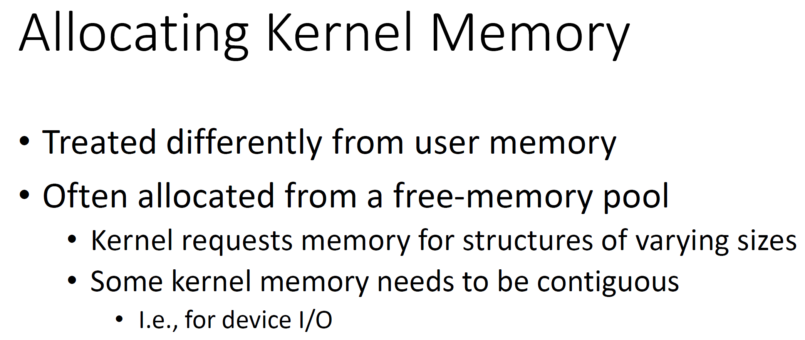
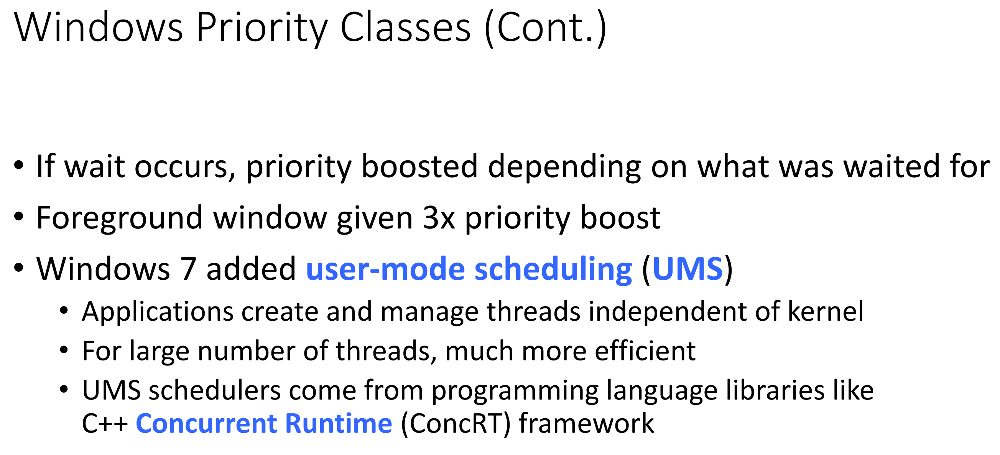
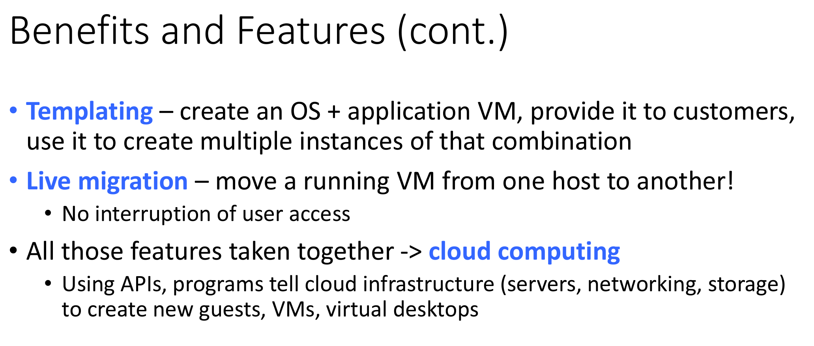

# CMSC412 Lecture 18  
> 10-31  

## Virtual Memory

Fundamental notion:  Being able to map an address space to any other
* Given N address and an address space, must be able to map to another one
* If not available, must have mechanism to get it from a different place (Secondary storage)
  * May also store in main memory?
  * Commercial operating systems: more complexity  
  * Why is RL messier than examples in textbook?
    * Environment that our system will be in is unknown 
      * User, programs to be run, etc.
    * Must have a General Purpose solution

For a commercial system, a virtual memory system, must decide:
* Segmentation? Paging? Both?
* Page size?
* Page fault policy?
* ASOASF

Also need to consider HW support  

Windows page size: 12b or 32b  
* Wanted to see that the intel HW supports this kind of environment  

Say we decide paging, segmentation or no?  

* Segmentation comes down to HW support and ???  

In most of these things, make the page size == page on disk or sector on disk ???  

Concerned with how to handle pages!!  

Swapping: Take out all pages alloc to a process and put it in storage to free space up for other processes  

Pageout daemon and works like clock algo
* For each page, we support one extra bit  

When paging out, just put it on a free page list
* Do not change contents!
* If e get a reference to it, jst find it in list  

Say the machine has 32MB of memory
* what number of free pages? Portion of memory for free pages?
* Determined by `lotsfree`
  * How big is `lotsfree`?
    * 1/3 at first, ???

 

Overloaded: Too many page faults  
* Swapping avoid us entering thrashing condition!  

So much paging done that ??? becomes low  

  

  

Based on 4.3 UNIX  

  

*Look this up*  

The primary ach on which this was implemented was ???

HW did not provide modified bit. Why?
* we dunno lol  

  

  

Instead of just getting page that the default is on, we get some more along with it ???

  

  

## Mass Storage

  

So far, we have talked about CPU and memory, etc.  

The complete addr. space has to be somewhere

Since we cant have large main memory, we must have secondary storage  

Having offline ones

*watch from 30 min to hear him waffle on about old storage things :))*  

Magnetic disks remain "dominant" for the past few decades
* Secondary because hey are not connected to the CPU ???  

In order to read or write, must remain under the head  

  

  

  

  

How long does it tak to go over the track?  
* Seek time

???
* Rotation delay
  * Max can be the time it takes to rotate once, min once

  

  

  

  

  

  

  

  
Can we do better than just estimating averages?
* Only if we know where everything is beforehand  

Transfer time depends on where we are making transfer from  

These days, most disk drives have their own cache
* Whenever you request sector, whole track copy is stored in the cache  

  

What does solid state mean?
* Solid state parts: No electromechanical movement 
* Made to be plug n' play  

  

  

100TB drives not as popular due to failure rate  

SSD have limited read write capability  

  

  

  

  

  

  

  

  

  

  

  

  

  

  

  

  

  

  

  

  

  

  

  

  

  

  

  

  

  

  

  

  

  

  

