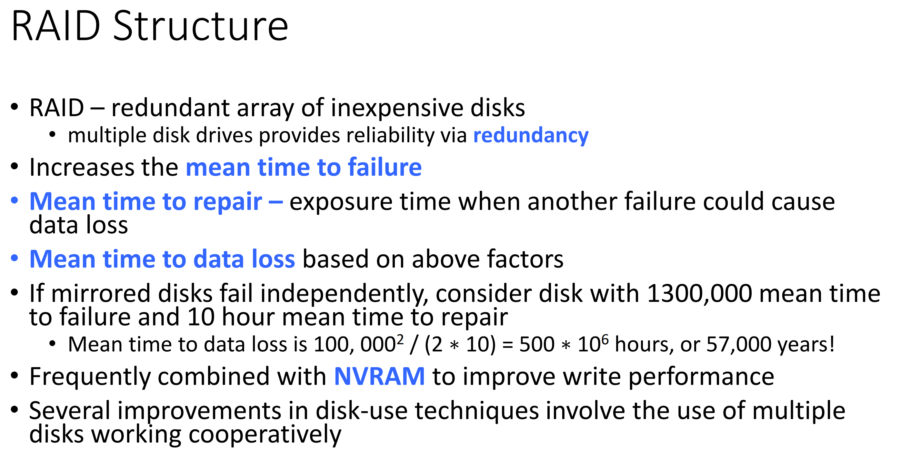

# CMSC412 Lecture 16  
> 11-2  

## Secondary storage  

  

  

  

  

  

  

  

  

Picking up from last class  

We talked about the kind of structures thats disks have  

Number all the sectors as large, 1D arrays  

Say there is this view that is maintined  

First sector: Last sector  

Floppy disks had a hole that aligned with a cover that also had a hole  
* Used as reference  

In the same way, our disks have a "reference" for when memory starts
* Arbitrary  

Goal: Arrnag e thigs s/t contigous things are reached quickly  

Most of the drivrs we have will have bad sectors  
* Yield head crashes
  * When the head of the reader scrtahes the disk itself  
* Surface is not as smooth  

Thee has to be a lwoer levl formatting s/t the tracks are identified  

At the manufacturer, they have to dcide how big the secotrs are  

Header of each secotr idefnited by the secotr number  

Bad secotrs have replacement secotrs  

Not necearraily contigous on the disk  

How to issue command ot a specific device via scsi bus?
* Must have address field  

Everything is implemented in HW  

  

  

  

SAN typically failry local
* Specialized for movement of information between servers  

Diffferent commincicaions for different purposes

  

Controller that has these protocols, we can make requests from anywhere  

??? 22~ in video

  

How is scheduling the disk different fomr the pther scheduling we have done? 
* CPU scheduler, mem. scheduler, etc.  

Three components in any tansfer

Goal: Make operations as fast as possible  

Rotational delay: how fast the disk is rotating  
* Scheduler cannot really impact this  

Accessing secoter in sequence, ???  

Who controlls whether we reas sequentially or not?
* Program itself

We can controll the seek time  

  

ANy kind on optimization only makes sense with many requests  

ONly time we can optimize nything is by reordering things around

  

Where does thi happen?  

Softwae based device driver  

^ Sequence of tracks we will access  

200 tracks  

In what order should we process them?

  

Min maxxing forsenInsanse

Minimize seek time  
* Unsucessful here  

  

Pro: Start off quick, then slow down?  

Built in bias to addresses that are closer to the middle  

  

  

  

  

  

  

  

What can we do about the rotational delay?  
* Very difficult since we dont have the right infomation  

how much does the disk queueing impact OS performance?
* Higher level question  

  

Each sector has pre-defined size  

DIsk IO done in blocks  

File IO done in clusters  

  

IO commands, instead of gong through file system, goes to controller
* May be beneficial in databases and such  

  

MBR: **M**aster **B**lock **R**ecord

WHo does the dirve numbering?
*BIOS  

BIOS keeps trck of configuraiton and to where to go to get the boot partion in order to start the computer  

  

Where we keep the copy of the virtual memory space on secondary storage  

Swap space: We know a lot about the structure of the information coming in  
* Overwriting DN make sense  

  

RAID SHADOW LEGENDS!!!  

We have disk drives that are fairly inexpensive  
* Multiple drives can give us better reliability  

  

  

  

Automatic replication of data is common nowadays  

  

 

  

  

  

  

Make the update of his disk an atomic action  