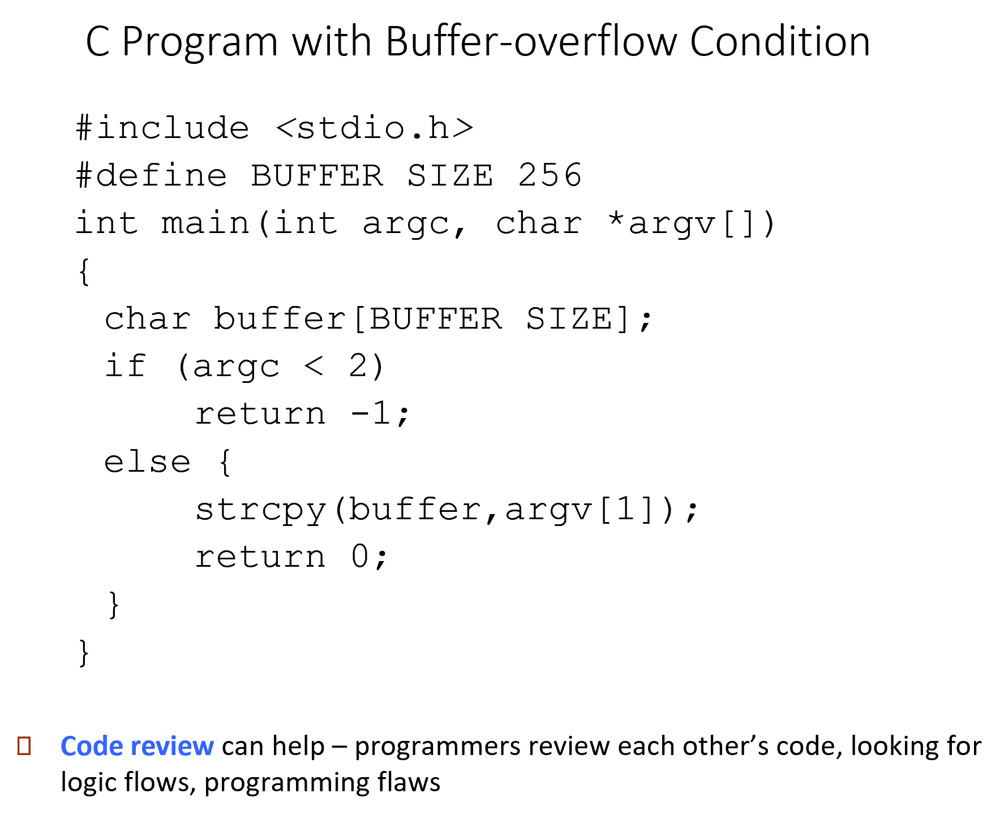
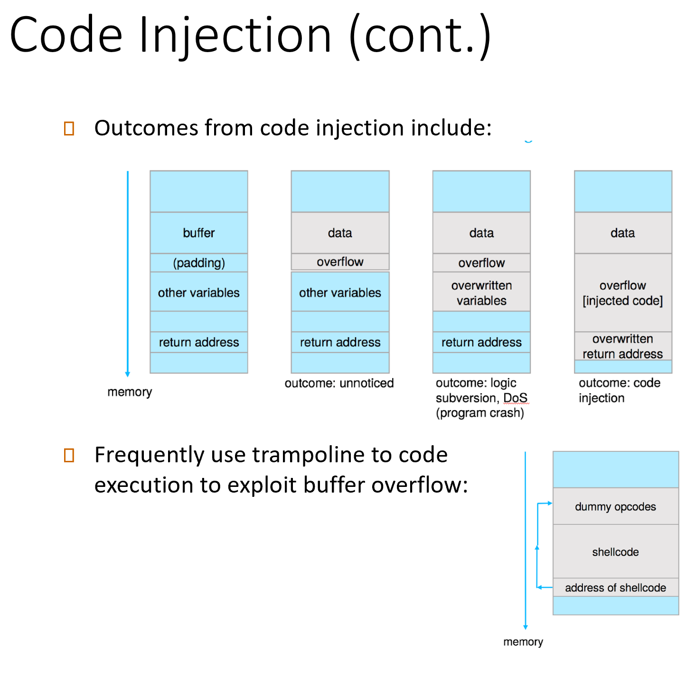
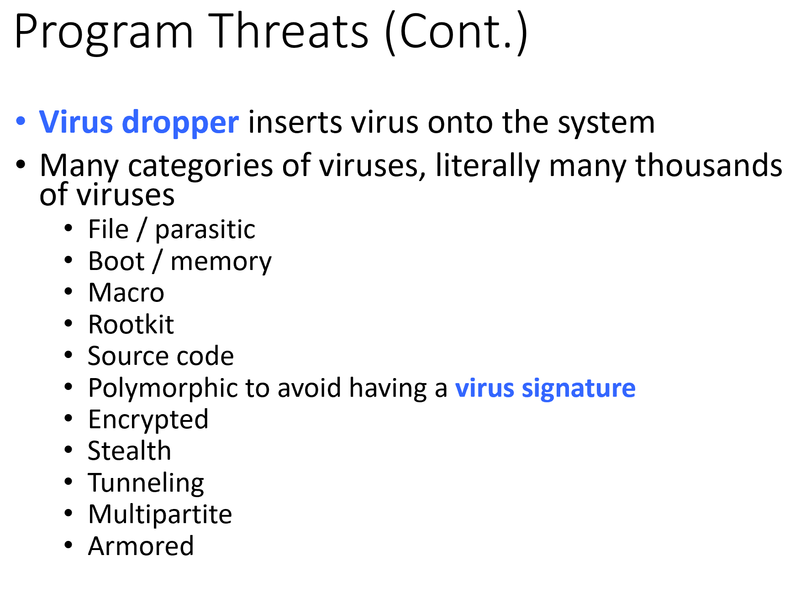
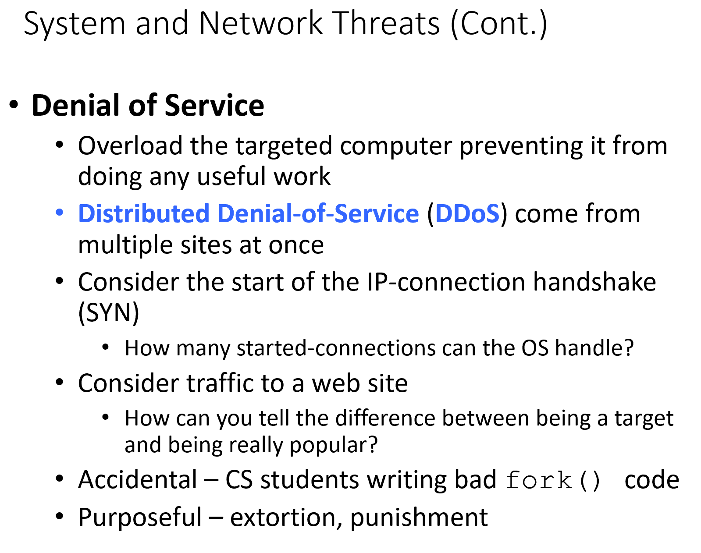
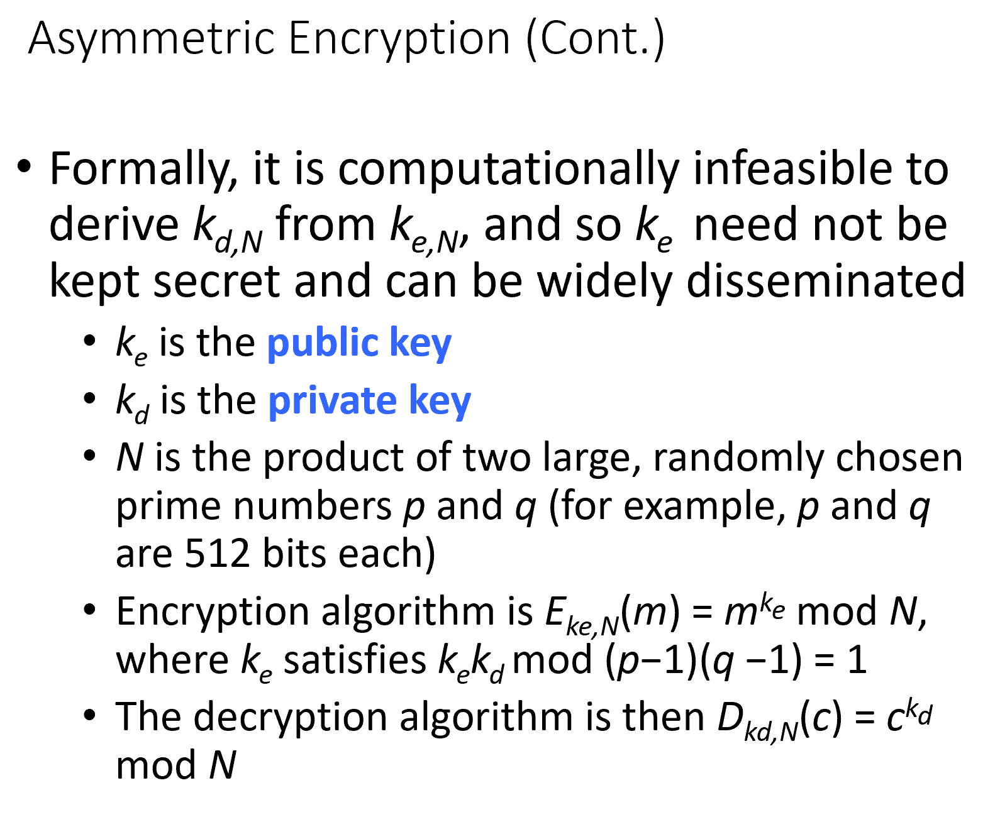
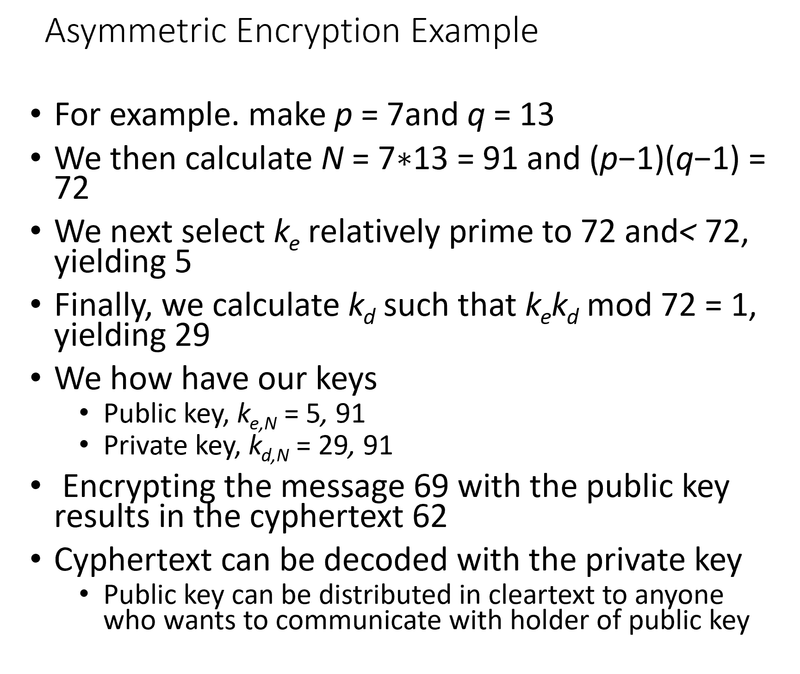
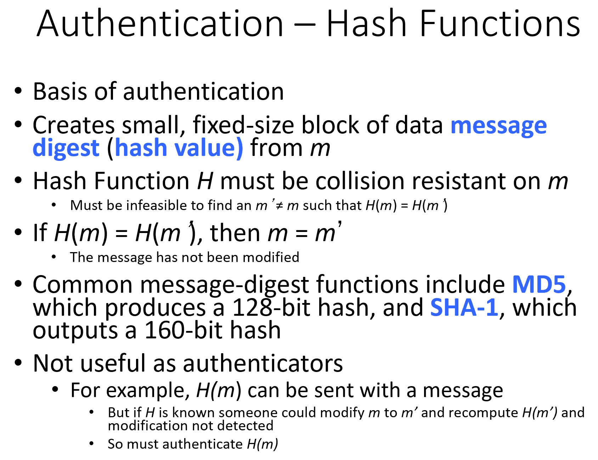
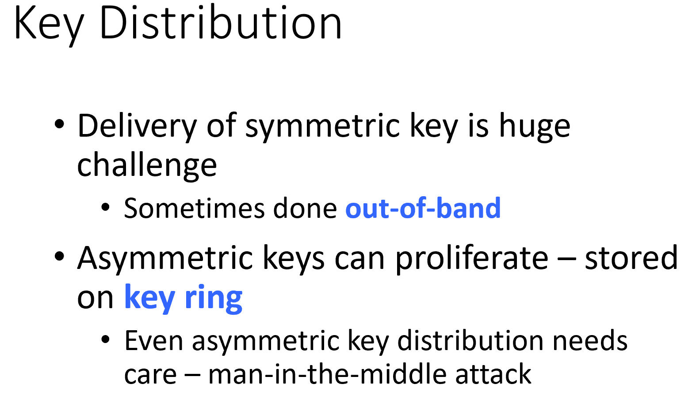

# CMSC412 Lecture 20  
> 11-7  

## I/O Systems   

  

So far, talked about CPU complex and devices  

Devices that we havent talked about are the sensors  

Difference between the devices we've discussed vs the ones we have not  

IO device: need to access that are not on the PCU or the motherboard  

In general, MOBO devices are much faster/ cna tlak to them quicker  

Main ones:
* CPU 
* Memory
* Display handlers
  * Still an IO device even if it is not on the MOBO  

If you take a lookat differn IO deivcec
1. info stored or retrueved by use for the compuer itself (mass storage)  
2. Can be the type wherre user interacts with them (mice, keyboard)

Distances may be larger  

high speed I/O, signal integrity matters  

We communicte using electrical connections  

If distances are larger and not on MOBO, cnnot do this
* Comms done with cable  

1 or more copper ires are placed on it  

As distance ^, communication delay increases  

Cable cannot be protected as well as on MOBO  

MOst of the IO ddevices we talk bout are semi-indeopendent units  

2 differen entities trying to communicate, and comms done by electricl channels, communicating using this connection  

Distances that are extremely small
* BUs comes in  

We want to transfer the info ASAP  

Want to keep them for short times, therefore we send pulses  

Pulse times depend on how long it takes to get recieved  

How does the reciever smaple the pulse at the right time?  

If not exminig, pulse comes and is not seen  

IN any communcation, both parties must agree for any communcation to take place  

When you are talking aobut comms on a bus, have multiple wires and signals available and build HW capabilites to be able to send signals and he like  

Receiver is always watching the line  

caled a handshake!  

Handshake goes on at Low lwvwl  

Better ww know what goes on at loweer level better we can understand highr level stuff  

What should we send? 1b at a time?  
* Nearly all internet connections are serial  

Multiple bits: Bus better have multiple parallel partss  

Mupltiple parts, what should we send?  
* Something consistent of the sender and reciever  

Want to comm. info or data  

Data may be in b, B, etc.  

Make bus where staa is sent as bytes  

Sender may want to say what the reciever hould do  

hich of the deviec on the bus should the data be written on  

Only one deivce at a time?  

Multiple devices: No need for multiple busses
* Must identify devices by way of more lines  

***Watch video from here, went to bathroom, bit before he rambled on about AT&T***  

On a bus we have many lines  
* Not all chacateristics will be the same  

Electrical signal delay will be different  

  

  

Devices vary eveyrwhere  

Every deivce makes their own things?  

Each device has a device controller supplied by the manufacturer  

Connected to bus and muct conform to bus protocol  

BUs protocol: Set of rules that 2 parties agree on with any communication  

Device scontorllers that speak this  

New deives always coming it  

Coming from CPU side  

HW implementing device controller, how atonomous is it?  

  

Autonomy == processing unit  

What are we trying to communicate with?  
* CPU complex  

Mus tbe able o use bus, must have bus interface connected to motherboard  

  

Nything directly onnected to bus must conform to protocol  

Since multiple units, must worry about who uses it and when, for how long , etc  

May be n amount of busses  

Main thing processr is doing is executing instrucitons  

Has interface to PCI bus  

What must the interface on the CPU side have?  
* BUffers, etc.  

Different types o=f controllers tht have different capabilites  

microcode: instrucions that can be execed at low level  

Microprogramming has very limited instructions due to its size and height  

  

Move some info from CPU complex into some registers in microcontroller that is connnected to bus  

All these devics were made long time ago TM  

Executing machine instruction from CPU
* Machien instructions that can midify registers  

Memory-mapped IO  

  

How mush do we read from deice at a time?
* 1 byte, word, etc  

Buffers in device controllers tend to be small  

Need to cause in to CPU to transfer data from bufer in device contorller to CPU complex  

Make the controller smarter and tell it we want the info to be written in ram from loc A to loc B  

  

  

How does a CPU carry out any of the IOs?  

  

Using 3 cysles can be wasteful  

Causes interupt to CPU  

  

  

Whenerva an interrupt occurs, how does computer know where to go?  

Stored in interrupt descriptor table    

  

Must be very fast  

  

Campableof writing into main memory 

  

  

  

device driver vs controller  
* Driver: SW
* Controller: HW  

  

Random access vs direct access 
* Rnadom: access time to any place is the same
* Direct: Access time may vary, but we are going to it striaghtaway  

Asynch transfer: 

Timing diference

  

How large is the device driver code?  
* conditinos tha it has to handle are large  

  

DMA for character devices?  
* Doesnt make sense for ti  

  

  

Is a clock an IO device?  
* Does clock keep runnig when you turn the computer off?  
* Clock on motherboard has its own battery and keeps running 

  

  

  

  

hehe, cope  

  

  

  

  

Who handles the errors?  
* Progrmamers xdd  

  

All IO instructions are privilieged  
* Helps against DoS attacks, etc  

DO not let user program carry out any IO calls directly

  

  

  

  

  

  

  

  

  

  

  

