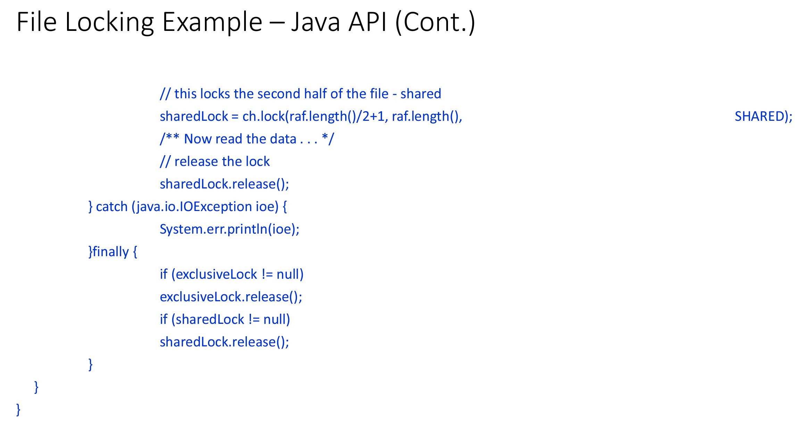

# CMSC412 Lecture 20  
> 11-9  

## File systems  

  

Long-trm sotrage of data  

Organization
* User oriented
  * Naming
    * symbolic
    * unique

Storage
* Secondary devices
  * Disks
  * Tapes

Access
* Fast
* Flexible

Ownership
Efficiency 
* Storage
* Access

Robustness
* Data loss

Security
* Controlled access

Framework
* ***FILE SYSTEM***

We want to give users the capability to name files however they please
* Systemwide, must be unique  

When we are soring the file, what aditional info must the file have to make our life easier?  
* Size
* Date of creation

For discussion purposes, we will treat alll secondary storages as disks  

What is "Fast"? sounds like a Vsauce video title lmao  
* Fast as possible  

Owners should have all the rights  
* If owner restricts rights, can teh system get to it?
  * Yes, must have some way to organize the system  

3 categoreis: 
* Read 
* Write
* Execute  

Are these sufficient?  
* Depends on the types of things we can do  

Should we have heirarchal structure on naming?  
* Translation becomes straightforward  

Robustness is a property of the storage device  

As an owner, you should have the rigtht to declare who can and cannot access your files  

  

  

WHen we talk about a file, a common conept is that it consists of a list of records  

Can we fit all tyoes of information into thse 3 types?  
* Ye lol  

File is sqeuential, but we want to map it to direct maping  
* Most of the time we access things sequentially, but sometimes will be fragmented  

Whst kind of metadata is relevant?  
* Name
* Identifier within file system (unique) 
  * File system does the meapping  

Say you have an OS. What poriton of the code of the kerel is the file system?
* 30 - 60 %  

Needs to keep track of the files not coming into the system  

  

These attributes shuold be stored on the secondary stoage along with the files themselves  

To use any of these files, and information needs to be brought in  

Copy in memory different from copy in storage  
* Synchronization is done by keeping track of when there are modified files (dirty bits, etc.)  

In unix, every file traet as a list of characters

Issue: Talking about these files with unique names
* Organize the files into groupings
  * File folders, directories, tc.
  * Grouping these files, and keep track of metadata in this way  
  * Can quickly find out what files are in the folder  

  

  

Remember: To carry out any operation on any file, need to execute program  

Part of file needs to come into file  
* Take name and look through  

Before any program can access any file, file must be open  

  

  

For every access made to file, need authorization
* Dynamically done 

  

  

Shared lock on readers  

  

  

This system came about with Windows  

  

  

  

  

  

  

  

ONly relevant poriton are brought in when needed  

  

  

  

  

Ended here for some reason???

