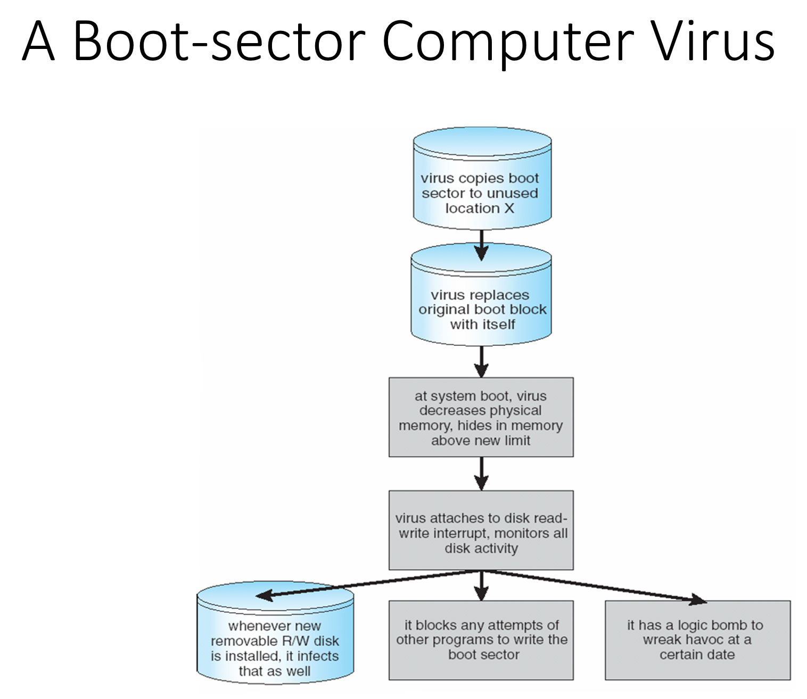
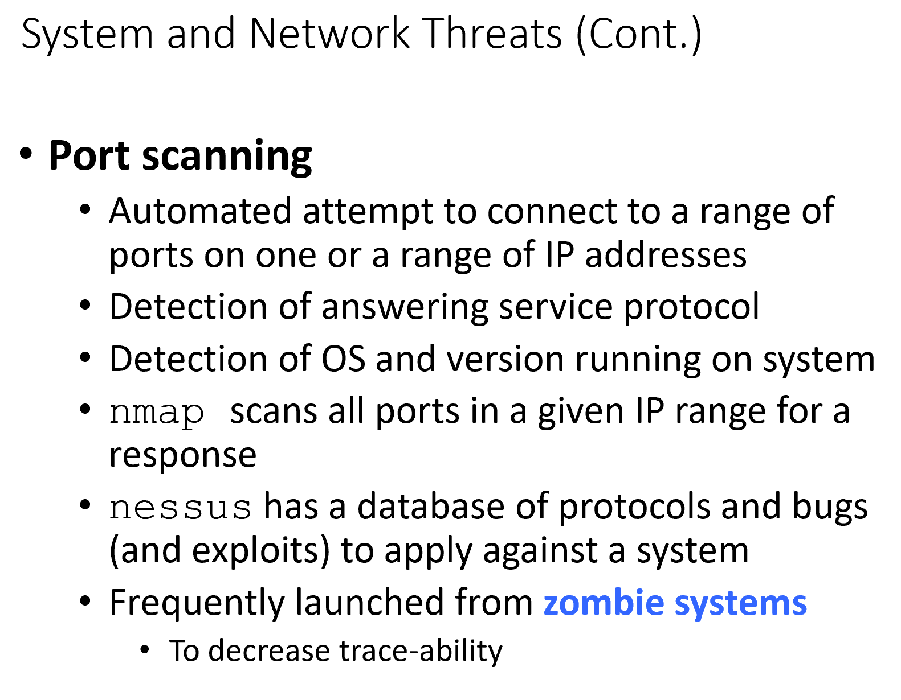
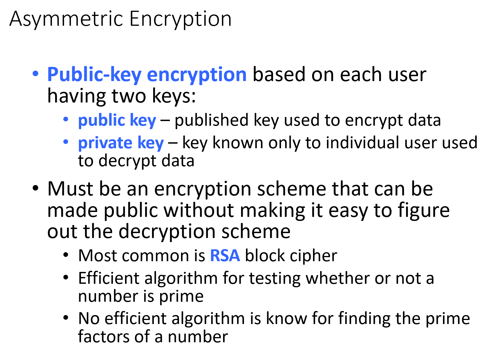

  

What IS a file?
* Logical storage unit that is primarally user defined  

Structure that we impose on the data that we want to store for a long time  

How to organize it, how to store it, etc.  

We typically orgainze these things into a colleciton  
* Called directory or file folders  

One of the simplest things we must do is to find the file  
* Must give it a symbolic name
* Self-descriptive  
  * Program shoudl then be able to find it on secondary storage
* Based on symbolic name, should be able to find the particular file  

Does using folders help?
* Depends on convention used when nameing files
  * File names must be unique  

One way in which to orgainize it to habev convention for all file names  

Collection of files in directiry that keeps track of what files are in there
* Must be abele to search directory 
* Create
* Read
* etc. (See slide ^)

  

  

Have directory that is for all users 

How do we know that the file name is unique system wide as a user?  
* Sol: 2 lvl

  

  

Go even firther beyond  

Start nameing files aftr the path name  

  

Curren directory concept useful in order to make programs portable 
* As you use the programs, and change directories, you can still access the files relative to the current files ???

  

  

Why have multiple names?  
* Have multiple users make changes on the same directory  ???

  

We are introducing another dir. entry type  

  

How many times would we need to cycle round with the name avi and book?  

Garbage collection can help avoid cycles  

  

  

With any volume, will have its own file system as a structure  

Will work with one overall file system at a mount point  

  

  

Sharing should be done in a controlled manner  

What kind of structures for controlled access to files would be the best?
* Should we be able to specify on user to user basis what they can do to the file that we own?

Keeping track an maintainting consistency become chalenges  
* most extensive way to hav file controll is to specify on each user basis
  * Called "Access control list"  

What are different access we can share with others?
* Read, R/W, exec only  

  

  

Must have faileure modes for files sytems  

All WWW ar stateless  
* Each request is stateless

  

for most of the cloud baed storage systems, consistency is maintained transparently  

  

  

  

  

  

 

Now we are tklking about the maechanisms to perform this  
* Want to do this transparently  

Any info about the file system must be on secondary storage  

verything that is modified mus be put back without corruption of data  

  

  

  

Device controller: HW that carries out device driver commands  

Basic file syste can rretain certian copies in the buffers or caches and can supply them when needed  

  

This is a layerd style foe structre!!  

  

Standards specify how certain things should be built
* With them, any programs that follow the same standard will play nice with each other  

  

When any request comes in, there must be some aprt of it in memory  

  

Partitoin: Portion of disk that we treat as indpemendetn  

MBR: MAster boot record  

What dos th edisk look like? 
* LInear aray of blocks  

  

  

FCB- File control block  

  

  

Can we, by bringing in information into memory, improve the system?
* For all systems, must open file that precede any file  

Need to check if file has been opened by somebody 
* why do we need 2 per process open file tables?  
  * Done so sonce different processes may be accesing it sequentailly ???  

Must all files have currnt location concept?  
* vst majority of accesses to file are sequential  

Keep track of current location in file  

  

Must the entry in the system table also be deleted?
* Depens on who is using it
  * If any file closes it, the count of active users goes down  

  

  

  

  

  

Storing stuff contigously benefits us when we read things sequentally  

  

  

  

Extrnal frag: Allocation scheme is cont., but space free is not contiguous 
* Of the space that isnt alloced to anything  

internal: Unuesd space that has alreayd been allocated to you

  

Do we really need to read each block to get to the next one?  
* Yeah, duh  

  

  

  

How big can w make this table?  
* Depends on the vloume that we support  

WHatever is the number of blocks, we shoudl use them  

  

  

  

  

Similar to 2-lvl paging  

  

  
