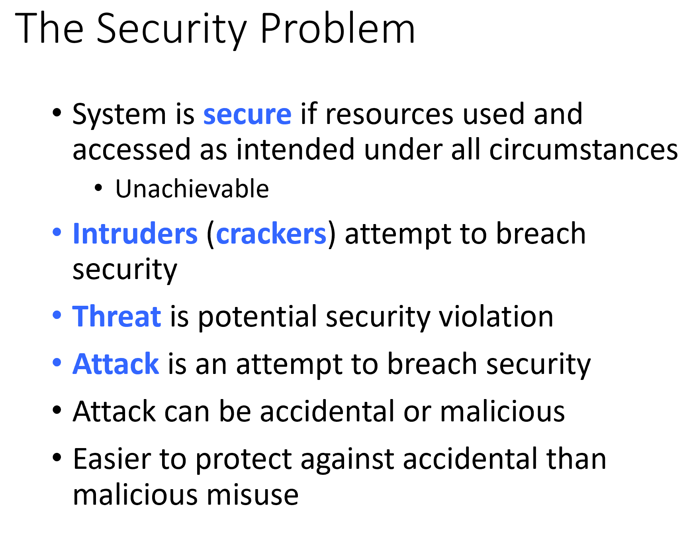
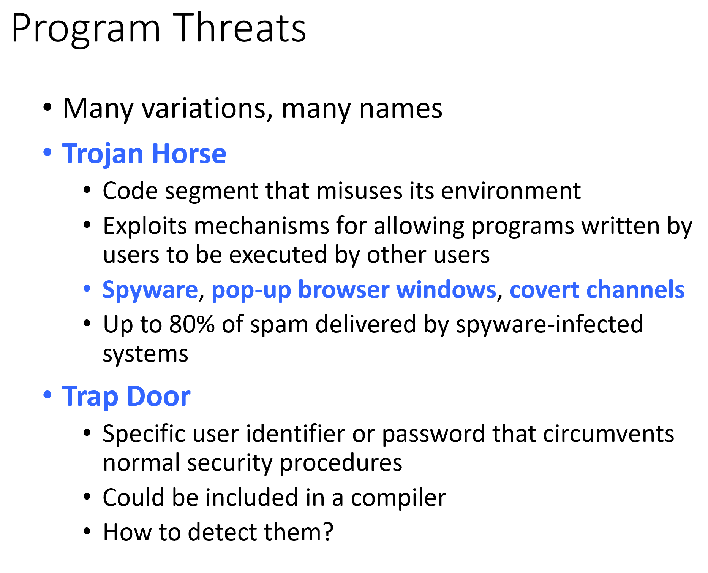
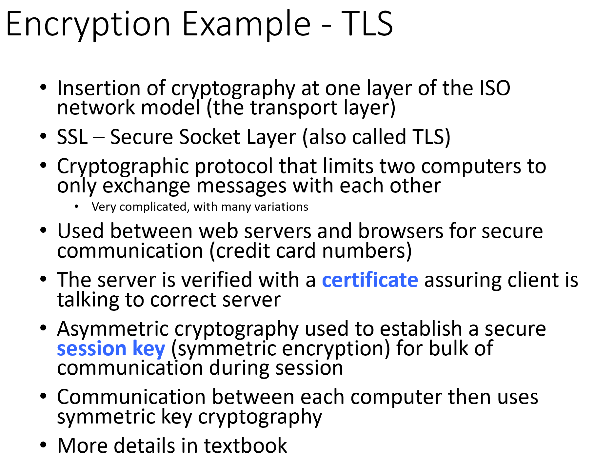

# CMSC412 Lecture 22  
> 11-14  

## Security  

He didn't really go over these slide, more so he read off of them for the most part. Some small comments that he made that I thought were worthwhile I have included, but somethings I didn't cus I took ENEE457 last year and most f the concepts form that class are repeated here (albeit in a much more watered down way)

  

  

  

  

Intended purpose is defined by the manufacturer
* Some entity that defines the inteded use, and assume someone else is trying to abuse this  

  

  

HW support for security:  
* Way to get many random bits for security
* Truly randomness can only be done in hardware
  * Rely on the physical properties of the hardware elements to generate random numbers
* There are chips that take informaiton and process for specific applicatons  

SW support:  
* Algos for encrytption and decryption  

Doing things in HW means that you cannot chnge thisgs remotely (underlying infrasctucture)  

For security, we kept information in registers in order to verify authorized access  
* Low-lwvwl secure execution of programs  

  

  

  

  

IN order to break into a system, must access as though you were a user  

CLicking on an email attachement means that we let the attack come through with our own authority  

Say you are buildng and distributing an application
* Someone has a problem, can we access it remotely?
  * Someimes trapoors are useful and practial, but can be exploited

  

  

  

  

  

  

  

  

  

botbet: Collection of computers that use software to take some actions whcih are in sycnh  

  

  

  

  

  

  

  

  

  

  

  

  

  

  

  

  

   

  

  

  

non-repdiatoin: Once we have recieved the message, we cannot deny it

  

  

  

  

  

  

  

  

  

  

  

