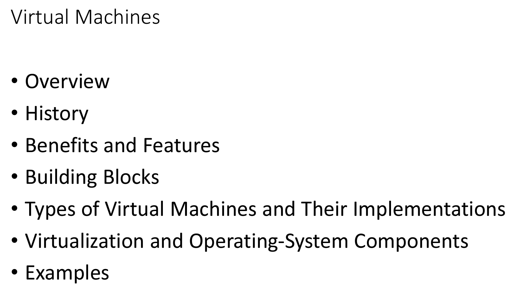
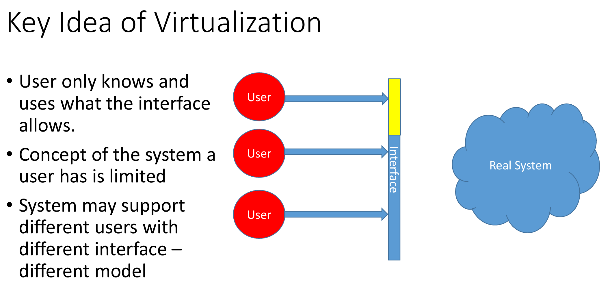
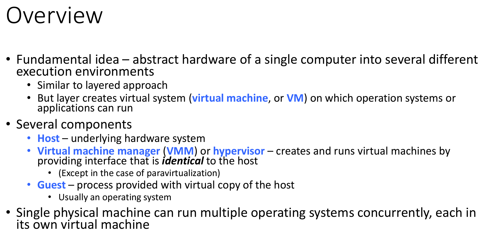
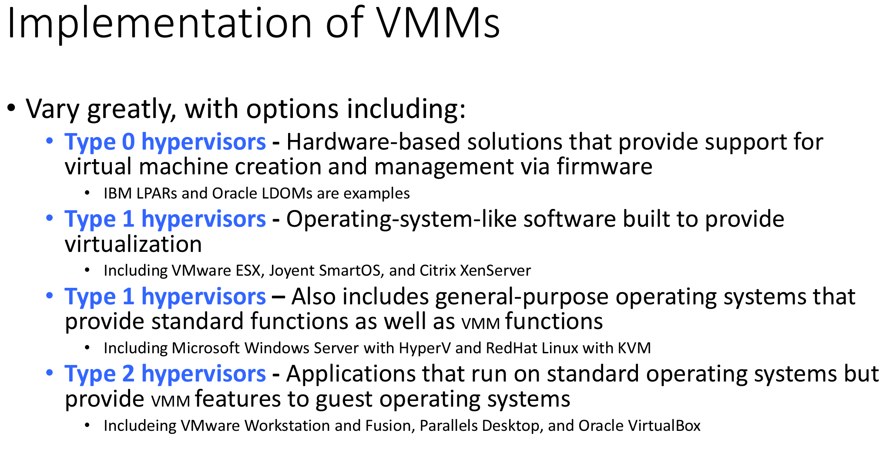
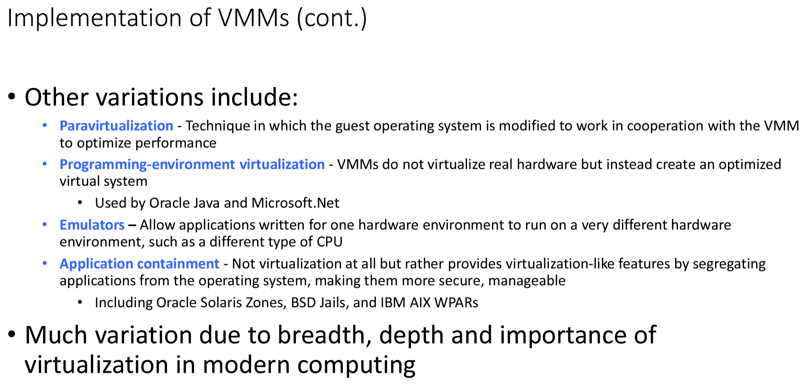
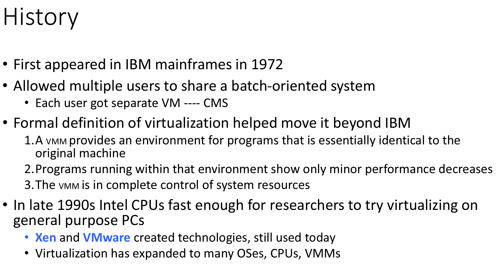
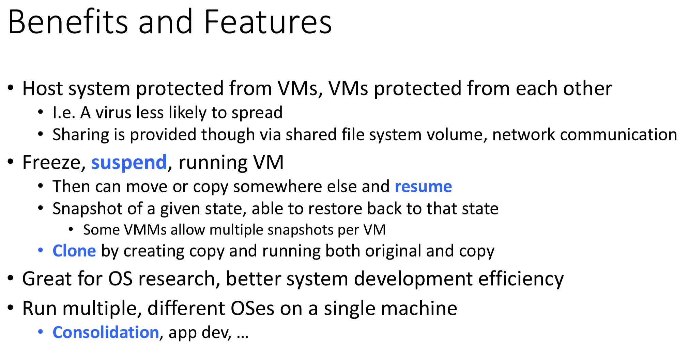
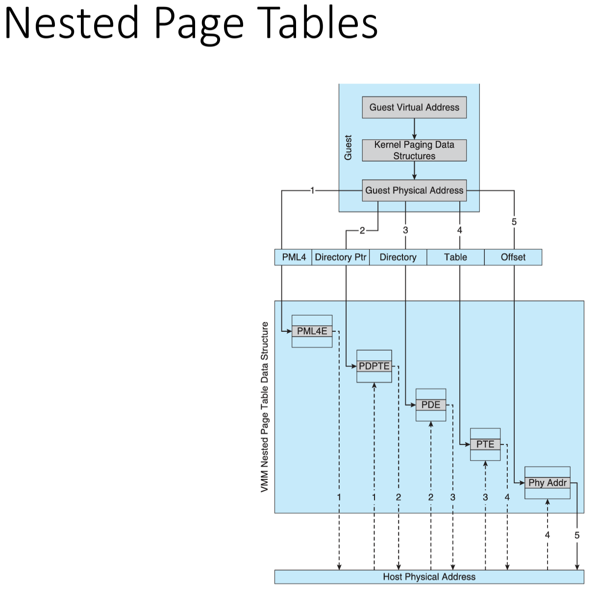
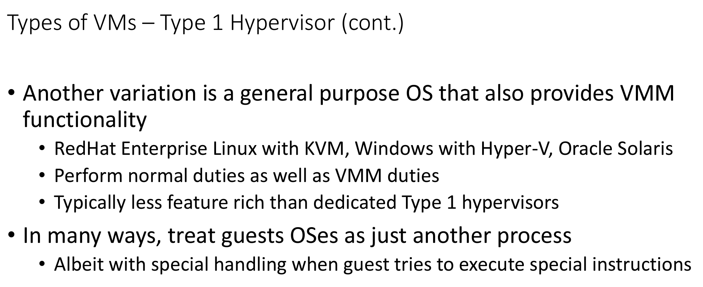

# CMSC412 Lecture 22  
> 12-5  

## Virtual Machines  

What does virtual mean?
* The only thing that can execute anything is the physical hardware
* Physical hardware designed to carry out certain set of instructions  
* Can we give a different impression to the user?
  * Yes, dont let the user touvch the HW at all

If user can only do the particular things a given API allows it to do, is that virtualization?
* Yes

Through use of AAPI and other thigns, we translate thre users request to be executed on hardware  

Process: Each pricess is independent of all otehrs.
* Processes do tno trip otver each other thanks to the OS  

USER does not know jhow many proceses are running at a time
* Is this vietualizaiton?
  * Yes!

We tell the uset that we can adres x amount of byter, even though HW will never have that amount of bytes

Whatever inxstrucitons come from wherever, we can translate them into executable instructions, and thisees executable instructonis carry out the impressions to the end user  
* Impression being that there is a large amount of information available  

Doing this, what is required?  
* Copy of all the address space must be availble to the process at runtime
  * DN have to be in main memory, ay be in secondary storage 

Gives impression!  

How far can we take this concept of virtualizaiton?

  

  

  

Each user has impression strictly that they can carry out 

Can we structure this st the user asumes that the capabilites on the sytem are common?

  

IOW, each user has their own API
* Makes the interface to contect with the real system more complex

User view:
* Executing Progams
  * Inst. set
    * Emulation
    * interpitive exec
  * Addr. space
    * Virtual mem
  * UI
* IO
    * Devices
    * files sys
    * ...
* Operating system

User only knows about these ^ Things what the interface will allow it to know

We need to make the life of the user simpler!  

* Real systme
  * Operating system
  * Processes
  * Devices
* HW support

We can fake memory, execution env., 
* can we fake the instrucion set?
  * only instrucions we can executie are the native ones that are avialable on the hardware that is underlying

As long as, at runtime, when the users progrmam isssues instruciton, we can carry out the functions that *emulatte* the instrucitons of the intended instruciton using the instrctions we ar elimited by  

We may have the execution of the instruciotns using micrcode, etc. 

We can still execute the original instruciton set, just with more steps

if the virtual and real instruciton set are the same, we gain some advantages
* No need to translate

Issue becomes, can we, in a process, given each user the access to the native hardwae, can we change the machine that is underneath?
* Many ways to do this

  

Single mahine ebing able to virtualize multiple kernels, we cna treat each virtual machine as a process in the eyes of the virtual machine manager

  

All tranlation is being done in a layer beneath the process  

This vurtual machine looks to the user, the same as a non-virtual one to the user

2 layers:
* Virtul machine manager
* kernel

Why do we have differen kernels?
* This is a question for the virtual machine manager

  

  

  

  

  

What kinds of resources may we get from clouds?
* Virtual machines
  * Creating thousands of them

Cloud doesnt always mean that it needs to be Azure, AWS, etc.
* Cloud is just a concept

HOw much more compolex do things get with a cloud that has thousands of servers?
* Load-balancing
* Data center management is very importantTM  

  

Real-machine detects the interrupt
* Int. must make its way to the machine
* Is VM operating system in user or kernel? 
* Virtual CPUs used

  

  

In machine, instrucitons are executed at machine level  

  

  

  

  

Some copies a kept back  

  

Who is doing what is differen in this diagram!  

  

  

  

Guest generates general structure from here  

  

  

  

  

Company datacenter vs general datacenter
* Control of center
* Access
* 

  

  

  

  

  

  

  

  

  

  

Ho should the vmm schedule the CPU if the user thinks it has all the CPU?  

  

  

  

  

  

  

  

  

  

  

  

  

  