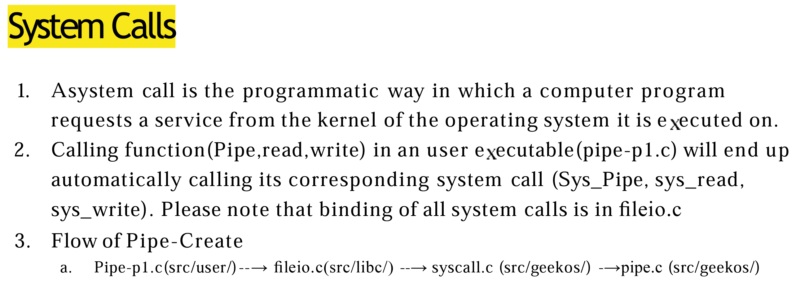
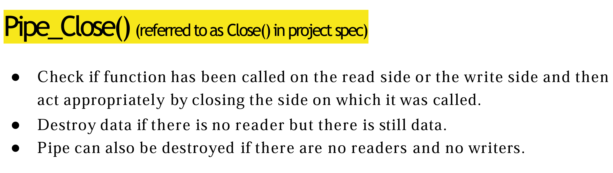

Why do we need pipe?  

Have 2 processes:

Each has own memory space  
* How do they communicate with each other?

SOl: have common buffer
* as one writes, one reads
* *This will be our pipe*  

We add one layer of abstraction to pipe  

P1 and P2 both have their own file structure. Both file structs point to pipe  

With this, we cannot control RW  

Create linear sturcture

P1 and P2 both point to a file. Both files point to common file that has some control variables (pipe?). Eventauly point to shared buffer  

Creating pipe requires 2 integers (file descriptor ID)  Process control block contains all info for process  

(Struct containing user_context)  

File descriptor table (all open ???) stored in user_context 

```

FILE* fdt(MAX)


```  

Will create 2 files:
1. Read in
2. Write in

```

struct FILE
reader

```  

We must make these files and store them in fdt  

both files fsd (file system data) have void pointer. These point to the pipe, 

Al long as there is a link from fdt to reader, we know there is a reader  

user.h has user_context (will use a lot in later projects)  

Project 1 will fork P1. fdt of P2 will have same fdt which will have 2 pointers pointing to the *same* read in and write in  

  

Any files are fair game for modification  

  

Calling functions in pipe.c

We implement stuff in kernel space  


pipe takes 2 pointers that point to integer locations read/write_fd  

  

In sys_pipe, need to create pipe and buffer. `add_file_to_descriptor_table` will add new files to fdt
* May fail! If so, clean up the files created  

`Copy_to_user`
* read_fd and write_fd are user-space *???*  

If user declares a number address, 

destination_user is memory space relevant to user (AKA offsets must be used)

Ex. If user space starts at 0x8000, and user puts in 0x1000, address is actually 0x9000 *???*  

  

struct file has file operations  

  

When you want to do file IO, you start at user layer (PIpe-p1.c), syscall.c makes sys_read which calls `Read` which is in vfs.c. Once we know the read is valid, we call pipe.c to make the read *???*  

Pipe-create  

  

*readers and writers should be boolean?*  

Want to initalize all operations (fsData). malloc does not do this, must do ourselves.

Must define Pipe structure (not provided)  

Pipe_read  

Reads data from pipe  

  

Copy from pipe buffer into buffer pointer we passed the amount we specify in the call  

BUffer design options: 
1. Make static 32k buffer  
2. Dynamically allocate buffer  
3. Use circular buffer  

If buffer has 4 bytes and only read 2 bytes, 

1. shift to the left and get rid of first 2 bytes
2. make pointer point to data w/o altering it  

Pipe_write  

  

Never overwrite previous data  

Return number of bytes written  

All calls go into pipe_read and pipe_write  

Pipe_close  

  

in vfs.c, the pipe is freed for us *???*  

Testing  

  

Make own by copying these files  

All pipe functions we must make

sys_read and sys_write have been implemnted  

*Recommended order*
1. pipe_create
2. read/write
3. sys_pipe
4. close  

Testing

cd build ?

./geekos.sh

Terminal 1
make dbgrun

Terminal 2
make dbg  

