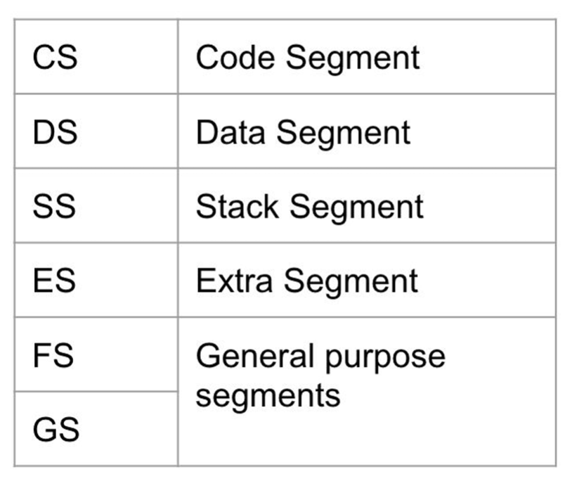
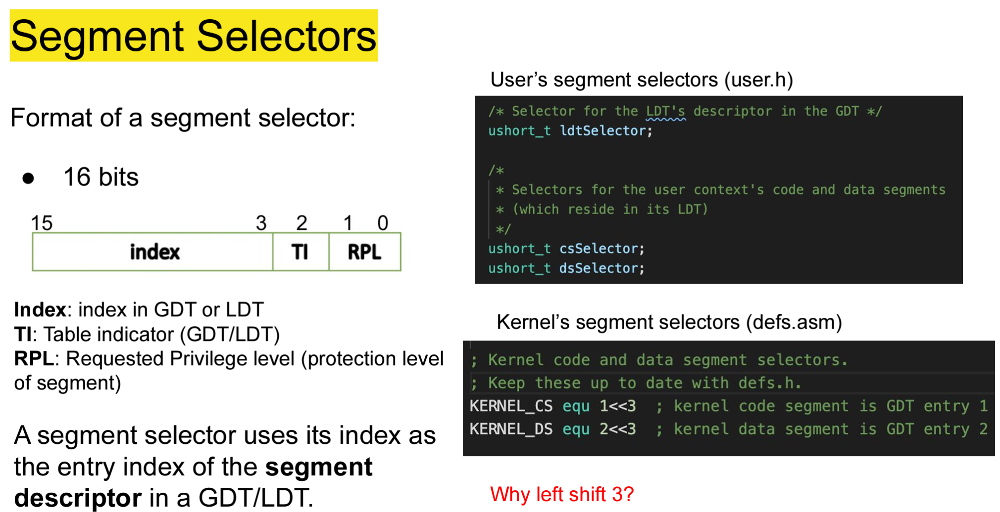
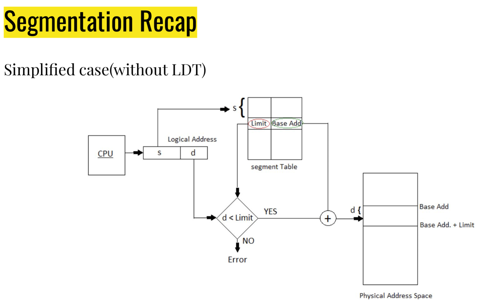
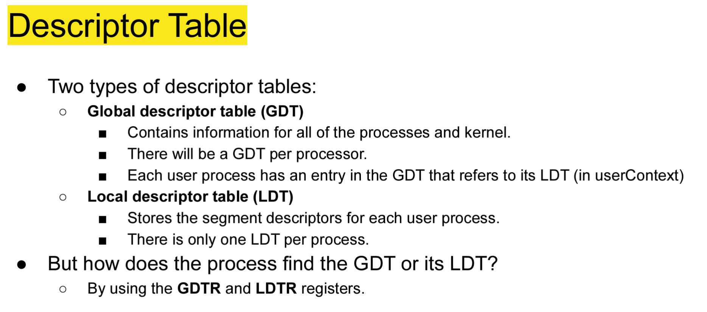
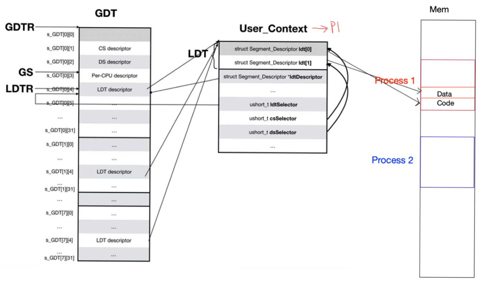
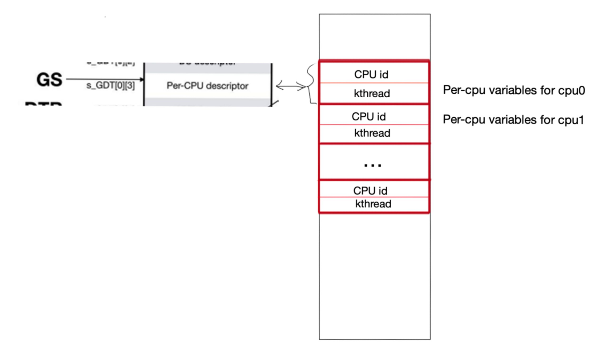
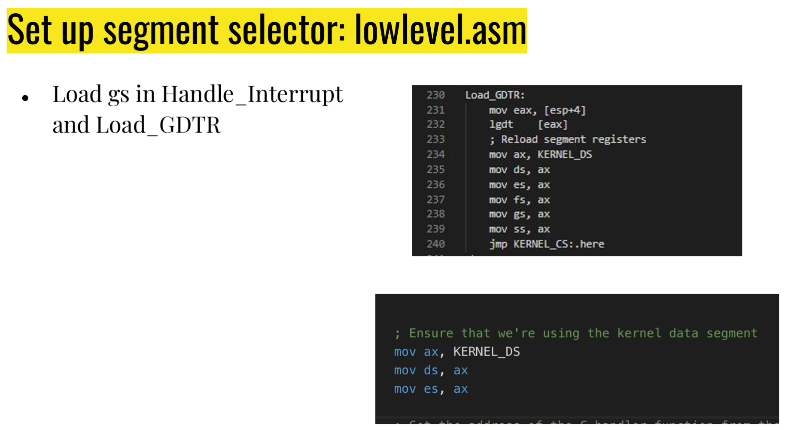
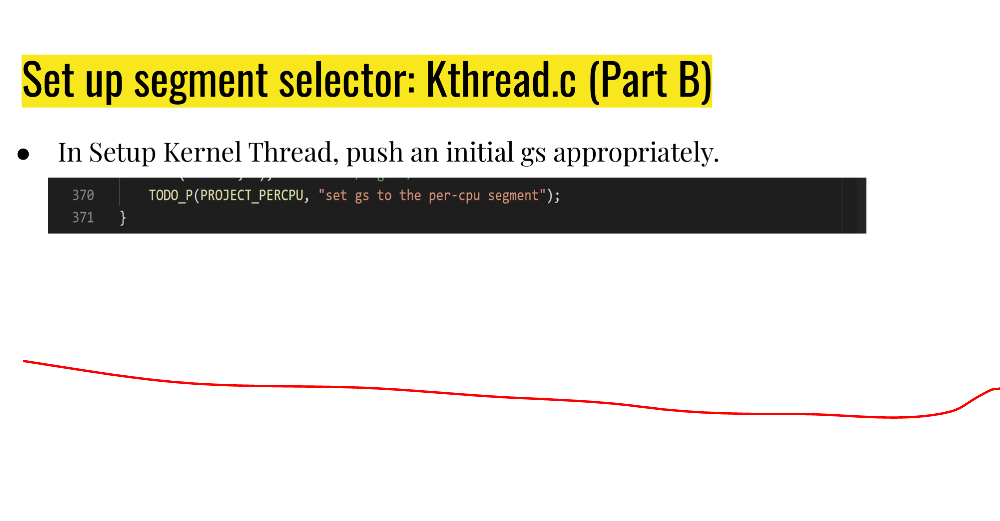
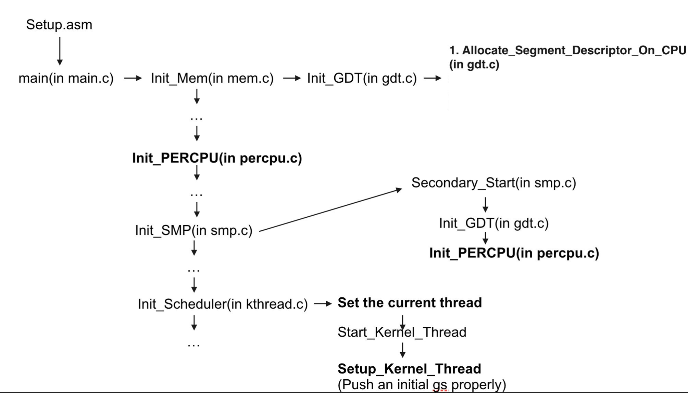

Find some memory and dedicate this mem to CPU.  
Each CPU will have its own memory segment  

2 vars:
* Current thread
* index of current CPU  

Memory is divied into different segments  

Each memoery space divided as well  

Usr prog has 4 segments  

  

If OS set up correctly, cannot go beyond the segment  

Provides why the memory can used relative memory references  

```
cs: 0x1000

```  

We are accessing the relative memory in cs ???  

When we copy over everything in fork, it works since everything is in relative state  

Start in real, go to protected  

There will be some segment registers: cs,ss,gs,rs...
* Each segment register is 16b  

  

One global table, and each process has its own local table  

Take base address from descriptor and offset it ???  

  

First few bits is used to look into the segment table (segment selector)  

From segment table, find right segment descriptor  

Take that limit and check what you are accessing  

If yes, add to limit and ???
* Yields physical address 

Memory chapter in book for context ig  

Take address we are looking at and add with the base address  

Kernel CS and DS are shift by 3  

When we have the GDT, [0][1] is CS, [0][2] is descriptor  

Look at register. We shift ???  

1<<3 gives 1 in index area.  

Segment desc. is 64 bits  
* Has base address and segment limit  

2 Decripor tables
* GDT
* LDT

Global des
* Contains all info of processes and kernel
* contains ldt info as well  

Local des. 
* Stores seg. 

GDTR and LDTR are the registers holding the starting addresses  

load_gdtr()
* Takes GDT and inits GDTR  

  

Kernel code segment and kernel data segments are the same  

Mapping between LDT and GDT is such that GDT[0][3] == [1][3]  

Each program will have its own GDT ???  

When we create a process, we will place an ldt into th gdt  

in UserContext, we have ldt desc with code and data segment  

Base addresses for CS and DS are stored in different areas  

  

First number is for the CPU, second is for the index within  

Descriptor contains all the information about the segment  
* You don't need to init segment, there is a function that does that  

All the fields will be the same except for limit and size  

  

Find memory space for the entire red-block  

limit for each per-cpu memory block is size of CPU id and kthread pointer (Usually 8 bytes)  

percpu.h and percpu.c  
* Define reblock struct  
* 3 functions in ".c  

gs:0 
* gs offset by 0  

perpu.asm
* Need to redefine 3 macros  
* Need to try to access current threa using gs register  

percpu.asm should be approx 9 lines  

smp.c
* get rid of atmoic locks  

init_GDT  

* Has code for initializing CPU ???  

segment.c
* Define new function to initialize descriptor for the percpu data segment  

defs.h, .c  
* Need to define segment selectors  

lowlevel.asm  
  

  

up to this point, geekos should spin up properly  

Booting up diagram:  

  

*If it doesn't work, tough tiddies*
> Geng Liu, 2023 (Paraphrased ofc)  

