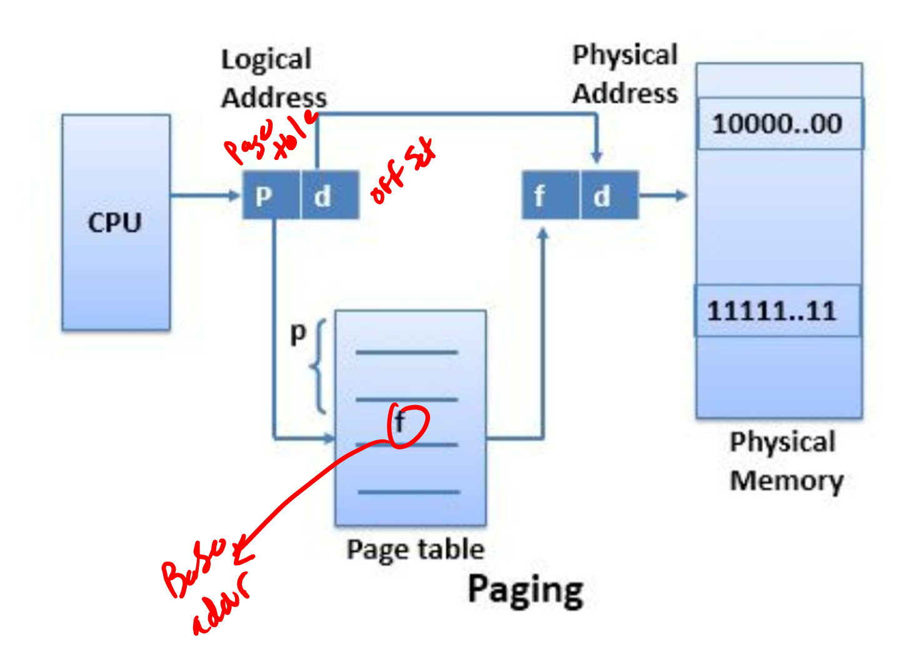
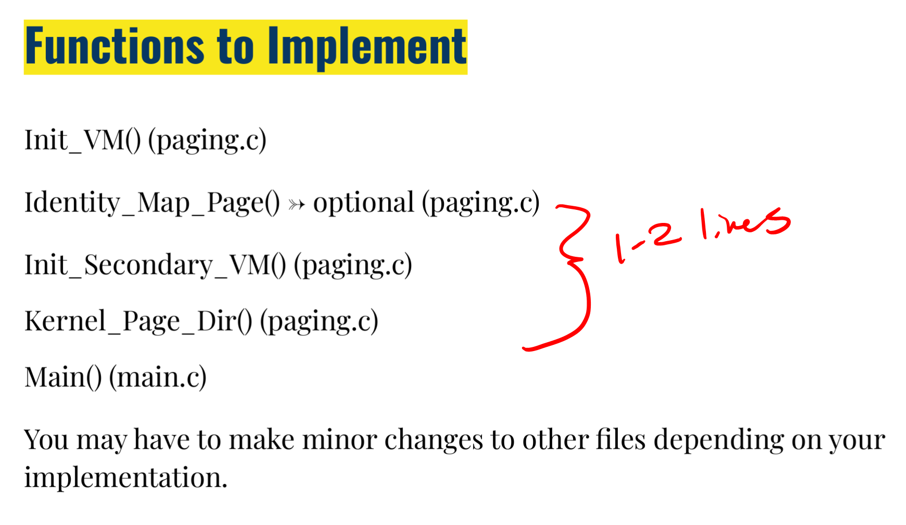
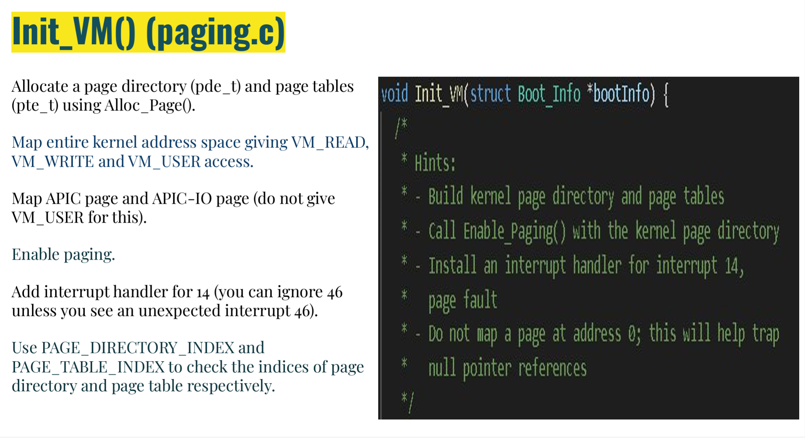
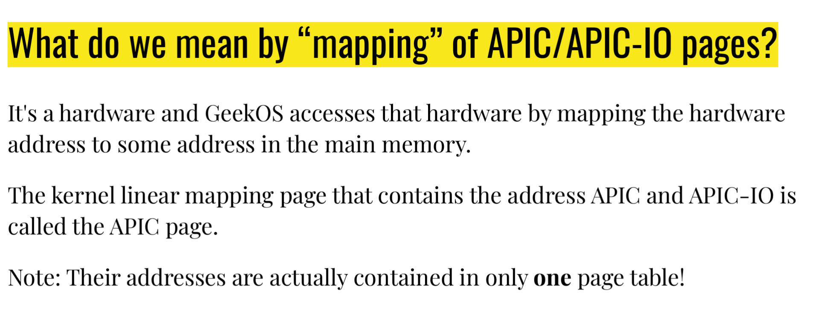
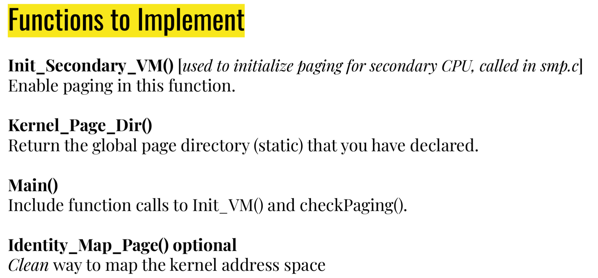

# Paging  

Due next Wednesday  

Why?  

Internal frg vs ext  

Each time we make ne process, we make new space for it  

Doing so will rexult in holes  

user_memory points to segment  

Paging: Divide phys memory into pages  

Page size == 4KB  

user mem is divided inot 4kb chucnks  

User maps to physical  

User has memory from0x0 -> size  

After proj 4b, 0x0 ->0x70000000  

Memory not in use is not mapped to physical mmory  

  

Creates internal frag, but fixes external frag  
* We care mmore about external frag than internal  

  

  

Only want to map up to memSizeKB  

Mapping 3 page diresctories  

Present: init to true

flags: Permisions  

pageTableAddr: For page direct entries, each is poining to ???  

~80 lines of code  

need 2 nested loop for init_VM  

Page_aligned_address means that the last 3 bits are 0. This means that we are at the base of a page  

  

  

Leo strongly recoomends implementing the optional one  

Kernel page directory is global and immutable  

need to call checkPaging()  

Do not map the first page!!  

